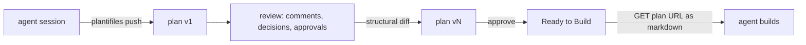
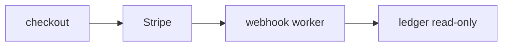

# Plantifiles — v1 Build Plan

Agent-native plan documents. A dev's coding agent publishes a plan, the team reviews it in the browser, and any coding agent pulls the approved version back as clean Markdown to build from.

This document is the complete v1 spec. Every decision below is settled — implement it, don't relitigate it. Where a detail is genuinely unspecified, pick the boring option and note it in `DECISIONS.md`.

## The loop v1 must close



A v1 that cannot demonstrate that full circle end to end is not done, regardless of how much UI exists.

## Stack

Settled. Do not substitute.

- **pnpm workspaces + Turborepo**, TypeScript strict everywhere.
- **apps/web** — Next.js App Router, React Server Components, Tailwind, shadcn/ui, Lucide icons, `next-themes` for dark mode, Mermaid for diagrams, Shiki for code highlighting, CodeMirror 6 for the editor.
- **packages/core** — framework-free: MDX vocabulary, parse/normalize, lint, block keys, structural diff, skim projection. No React, no Prisma, no network.
- **packages/db** — Prisma + Postgres.
- **apps/cli** — `plantifiles` binary.
- **apps/mcp** — stdio MCP server.
- **Auth.js v5** with the GitHub provider only. Audience is devs; GitHub OAuth is the whole login story.
- **Vitest** for `packages/core`. **Playwright** for one end-to-end smoke.

Base URL comes from `PLANTIFILES_BASE_URL`. No domain is hardcoded anywhere.

## Non-goals for v1

These are v2. Building them now starves the loop above.

Staleness/drift detection against repos, implementation status from PRs, plan graph relations, semantic search, issue export to GitHub/Linear, git two-way sync, suggestion mode, inline polls, realtime cursors, agent-written comment drafting, public link expiry/passwords.

---

# Phase 1 — packages/core

The whole product's consistency guarantee lives here. Pure functions over strings, fully unit-tested, zero I/O.

## The component vocabulary

Authors write Markdown plus **only** these components. Anything else is a lint error. The agent never emits raw HTML, and never controls presentation — `apps/web` owns all styling, so consistency is a property of the system rather than of the model's mood.

| Component | Props | Contains |
|---|---|---|
| `<TLDR>` | — | prose, ≤60 words |
| `<Decision>` | `owner` (required), `id` | the question as prose |
| `<Tradeoff>` | — | ≥2 `<Option>` |
| `<Option>` | `name` (required), `recommended` (boolean) | pros/cons prose or list |
| `<Rejected>` | `what` (required) | why it was rejected |
| `<Phase>` | `n` (required), `title` (required) | prose + task checklist |
| `<Risk>` | `severity` = `low` \| `med` \| `high` (required) | prose |
| `<Diagram>` | `lang` = `mermaid` \| `d2` (required) | one fenced code block |
| `<CodeSketch>` | `lang` (required), `file` | one fenced code block |
| `<Callout>` | `kind` = `note` \| `warning` (required) | prose |

Diagrams are declarative source only. The agent writes the graph; the renderer draws it in the house theme. That is what makes illustration style consistent and diagrams diffable.

Example of a well-formed plan source:

````mdx
---
title: Billing migration to Stripe
---

<TLDR>
Move subscription billing from the homegrown ledger to Stripe over three phases,
keeping the ledger as read-only history.
</TLDR>

## Why now

The ledger loses money on proration edge cases and nobody owns it.

<Decision owner="@srujan">
Do we backfill historical invoices into Stripe, or leave them in the read-only ledger?
</Decision>

<Tradeoff>
  <Option name="Backfill everything">
    One source of truth. Two weeks of work, risky mapping of legacy plans.
  </Option>
  <Option name="Ledger stays read-only" recommended>
    Ship in days. Support has to check two places for pre-2026 invoices.
  </Option>
</Tradeoff>

<Rejected what="Chargebee">
Pricing model punishes usage-based billing, which is where we're heading.
</Rejected>

<Diagram lang="mermaid">

</Diagram>

<Phase n="1" title="Dual-write">
- [ ] Stripe customer created alongside ledger account
- [ ] Webhook worker reconciles nightly
</Phase>

<Risk severity="high">
Webhook replay could double-charge. Idempotency keys are mandatory, not optional.
</Risk>
````

## Block keys

Comments must survive new versions, so every top-level block needs an identity that is stable across versions.

At publish time, `normalize(source)` walks top-level blocks and assigns each a `key`:

1. If the block has an explicit `id` prop, `key = id`.
2. Otherwise `key = <slug of nearest enclosing heading path>:<component kind>:<ordinal within that heading>`.

Also record `contentHash` (sha256 of the block's normalized source). Emit `Block[] = { key, kind, ordinal, contentHash, source }`.

A comment anchors to `key`. On a new version, a key that still exists carries its comments forward; a key that vanished leaves its comments flagged as *anchored to an older version* with a link to that version.

## The lint

Deterministic. No model call. The skill suggests the house style; the lint is what actually enforces it.

Errors:

1. Exactly one `<TLDR>`, and it is the first block after frontmatter.
2. `<TLDR>` is ≤60 words.
3. Every `##` section's first child is a one-line summary paragraph of ≤30 words.
4. No paragraph exceeds 5 sentences or 120 words.
5. At least one `<Decision>`, at least one `<Phase>`, at least one `<Diagram>`.
6. Every `<Decision>` has an `owner`.
7. Every `<Tradeoff>` has ≥2 `<Option>` and exactly one `recommended`.
8. Every `<Risk>` has a valid `severity`.
9. Heading depth never exceeds `###`.
10. No components outside the vocabulary table, and no raw HTML.

Warnings:

11. No `<Rejected>` anywhere. Six months out, "why we didn't do X" is the highest-value text in the document and always the part that is missing.
12. Read time above 12 minutes, computed at 200 wpm.

`score = 100 - (10 × errors) - (3 × warnings)`, floored at 0. Publish requires zero errors **and** `score ≥ 70`. `--force` publishes anyway and sets `lintOverridden` on the version, which the UI shows as a badge.

Every lint finding carries `{ rule, severity, message, line, blockKey? }`.

## Structural diff

`diff(prevBlocks, nextBlocks)` matches on `key`, then classifies each block as `added` / `removed` / `modified` (same key, different `contentHash`) / `moved` (same key and hash, different ordinal).

Render that to a one-paragraph `changeSummary` grouped by kind, e.g. `Removed 1 Phase (Dual-write). Added 2 Risks. Modified TLDR and 1 Decision.` Nobody reads a textual diff of a document, so this summary is the primary artifact of a new version.

If `ANTHROPIC_API_KEY` is set, additionally generate a prose summary from the structural diff and store it as `changeSummaryProse`. When the key is absent the structural summary stands alone and everything still works — this is an enhancement, never a dependency.

## Skim projection

`skim(blocks)` returns only `TLDR`, `Decision`, `Tradeoff`, `Risk`, `Diagram`, and `Phase` titles. Half-reading a plan is the normal behaviour, so make half-reading correct instead of fighting it.

**Phase 1 done when:** every rule above has a passing and a failing unit test; `normalize` produces identical keys across two versions of the example plan where the heading path is unchanged; `diff` correctly classifies all four change types; `pnpm test` is green in `packages/core`.

---

# Phase 2 — data model and publish API

## Prisma schema

```prisma
model User      { id String @id; githubId String @unique; name String; email String @unique; avatarUrl String? }
model Workspace { id String @id; slug String @unique; name String; requiredApprovals Int @default(1) }
model Membership { id String @id; userId String; workspaceId String; role Role }
model ApiToken  { id String @id; userId String; name String; tokenHash String @unique; lastUsedAt DateTime? }

model Plan {
  id String @id
  workspaceId String
  slug String
  title String
  status PlanStatus @default(DRAFT)
  visibility Visibility @default(WORKSPACE)
  publicSlug String? @unique
  createdById String
  currentVersionId String?
  @@unique([workspaceId, slug])
}

model PlanVersion {
  id String @id
  planId String
  number Int
  source String              // raw MDX
  changeSummary String?      // structural, always set from v2 onward
  changeSummaryProse String?
  lintScore Int
  lintReport Json
  lintOverridden Boolean @default(false)
  authorId String
  agentName String?          // "claude-code", "codex", "cursor"
  agentPrompt String?        // the prompt that produced this edit
  createdAt DateTime @default(now())
  @@unique([planId, number])
}

model PlanBlock { id String @id; versionId String; key String; kind String; ordinal Int; contentHash String; @@unique([versionId, key]) }
model Comment   { id String @id; planId String; versionId String; blockKey String?; parentId String?; body String; authorId String; agentAssisted Boolean @default(false); resolvedAt DateTime?; createdAt DateTime @default(now()) }
model Decision  { id String @id; planId String; key String; status DecisionStatus @default(OPEN); resolution String?; ownerId String?; resolvedById String?; resolvedAt DateTime?; @@unique([planId, key]) }
model Approval  { id String @id; planId String; versionId String; userId String; createdAt DateTime @default(now()); @@unique([versionId, userId]) }

enum Role { OWNER ADMIN MEMBER VIEWER }
enum PlanStatus { DRAFT IN_REVIEW APPROVED BUILDING SHIPPED ARCHIVED }
enum Visibility { PRIVATE WORKSPACE PUBLIC }
enum DecisionStatus { OPEN RESOLVED }
```

A `Decision` row holds only app state — status, resolution, owner. The question text always comes from the `<Decision>` block in the source. That way the document and the database never disagree about what was asked.

## Endpoints

Token auth via `Authorization: Bearer <token>`, hashed with sha256 and compared against `ApiToken.tokenHash`. Browser sessions use Auth.js.

- `POST /api/plans` — `{ workspaceSlug, slug?, title, source, agentName?, agentPrompt? }`. Lints, normalizes, creates plan + version 1 + blocks. Rejects with the full lint report on failure.
- `POST /api/plans/:id/versions` — same, plus computes `changeSummary` against the current version and re-anchors comments.
- `GET /api/plans/:id` — metadata + current version.
- `GET /api/plans?workspace=slug&status=` — list.
- `POST /api/plans/:id/comments` — `{ blockKey?, parentId?, body, agentAssisted? }`.
- `POST /api/tokens` — session-authed only; returns the plaintext token exactly once.

## The content-negotiated plan URL

This is the single most important surface in the product. One URL, two audiences.

`GET /p/:workspaceSlug/:planSlug` and `GET /p/:workspaceSlug/:planSlug/v/:number`:

- `Accept: text/html` → the themed reader app.
- `Accept: text/markdown`, `text/plain`, `*/*` from a non-browser client, a `.md` suffix, or `?format=md` → **raw MDX source** with a YAML frontmatter preamble containing `title`, `version`, `status`, `url`, `openDecisions`, `updatedAt`.

Because that path is plain HTTP and plain text, Claude Code, Codex, Cursor, and Aider all consume plans with zero per-tool integration work. Never gate the Markdown response behind JavaScript, and never return HTML to a client that asked for Markdown.

Private and workspace-visibility plans require a session or a bearer token. `PUBLIC` plans serve both representations anonymously via `publicSlug`.

**Phase 2 done when:** `curl -H 'Accept: text/markdown'` on a seeded plan returns frontmatter plus MDX and nothing else; the same URL in a browser renders the reader; posting a second version returns a non-empty `changeSummary`; a lint-failing source is rejected with per-rule findings.

---

# Phase 3 — CLI

Publishing must happen from inside the agent session. A dev who has to copy HTML into a web form never comes back, so this phase is adoption, not convenience.

Commands:

- `plantifiles login` — prompts for a token from `/settings/tokens` (Phase 4 builds that page), stores it in `~/.config/plantifiles/config.json` at mode `0600`.
- `plantifiles push <file> [--workspace slug] [--title t] [--agent claude-code] [--prompt "..."] [--force]` — creates or updates. Writes the plan id back into `.plantifiles.json` in the repo root keyed by file path, so subsequent pushes update instead of duplicating. Prints the plan URL.
- `plantifiles pull <id|url> [-o file]` — fetches Markdown. This is the command an agent runs at build time.
- `plantifiles lint <file>` — runs `packages/core` locally, exits non-zero on errors, prints findings as `file:line rule message`.
- `plantifiles open <id>` — opens the URL in a browser.
- `plantifiles status [--workspace slug]` — table of plans with status, version, open decisions, pending approvals.

`PLANTIFILES_TOKEN` overrides the config file. Honor `PLANTIFILES_BASE_URL`.

**Phase 3 done when:** on a clean machine with only a token, `plantifiles push plan.mdx` prints a URL, `plantifiles pull` on that URL returns byte-identical source, and a second `push` of an edited file creates version 2 with a populated change summary.

---

# Phase 4 — design system and app shell

**A published plan is a page of the app, not a document the app hosts.** No iframe, no sanitized HTML blob, no separate stylesheet, no `dangerouslySetInnerHTML`. A plan body is React components built from the same shadcn primitives and the same tokens as the dashboard chrome, so a plan and the plan list are visibly the same product. That continuity is the magic; losing it turns this into a nicer artifact host.

Read `skill://design` and follow it. Radix/shadcn primitives are mandatory over hand-rolled equivalents, Lucide for icons, semantic CSS variables per its `BRAND_GUIDELINES.md`, Inter and JetBrains Mono, design tokens rather than magic numbers.

## The theme

The skill's palette is the shadcn default — take the *mechanism*, not the identity. Pick a distinctive accent and one signature typographic move, then record both in `DECISIONS.md`. A layout indistinguishable from every other dashboard fails this phase.

Extend the token layer in one `globals.css` with plan-block semantics: `--decision`, `--risk-low`, `--risk-med`, `--risk-high`, `--phase`, `--success`, `--warning`, `--diagram-node`, `--diagram-edge`. Dashboard chrome and plan blocks consume that single set. Dark mode ships from day one, and the Mermaid theme config reads those same CSS variables at runtime rather than carrying its own palette — so one token change restyles chrome, blocks, and diagrams together.

## Layout

Fixed dimensions, so every route lines up and a plan page inherits the same skeleton as the dashboard:

- Sidebar `w-60`, fixed, full height, `border-r`. Topbar `h-14`, sticky, `border-b`.
- Content column `max-w-5xl` centered, `px-6 py-8`.
- Prose inside a plan sits on a `max-w-[68ch]` measure. A 12-minute document set at full window width is the single most common way a reader gets abandoned halfway.
- Outline rail `w-56`, `sticky top-16`, appears at `xl` and above.
- Vertical rhythm in a plan: `space-y-6` between top-level blocks, `mt-10` before an `##`, `mt-6` before `###`, `leading-7` on paragraphs.
- Bordered blocks are `rounded-lg border p-5` and sit flat beside each other. The one nested case is `<Option>` inside `<Tradeoff>`, which drops the border for `bg-muted/40`.
- Icons are `h-4 w-4` inline, `h-5 w-5` in a block header.
- Every block label uses one style: `text-xs font-medium uppercase tracking-wide text-muted-foreground`. That single repeated detail is most of what makes ten different block types read as one designed system.

Status chips are defined once and reused by the dashboard, the reader header, and the Slack unfurl:

| Status | Treatment |
|---|---|
| `DRAFT` | `bg-muted text-muted-foreground` |
| `IN_REVIEW` | accent tint, `bg-accent/15 text-accent-foreground` |
| `APPROVED` | `--success` tint |
| `BUILDING` | accent tint with a pulsing dot |
| `SHIPPED` | `--success`, outline rather than filled |
| `ARCHIVED` | `bg-muted text-muted-foreground/70` |

## The shell

Persistent left sidebar: workspace switcher, Plans, Decisions, Settings. Topbar breadcrumb `workspace / plan`. Command palette on `cmd+k` searching plan titles and open decisions. User menu with theme toggle. The plan reader renders in the same content region as every other page, reached by client navigation.

Routes:

- `/` — redirect to the user's last workspace, or onboarding when they have none.
- `/w/:slug` — dashboard.
- `/w/:slug/decisions` — every `OPEN` decision across all plans, grouped by plan, with owner and the plan's status. The team's "what is blocking planning" view, nearly free given the schema.
- `/w/:slug/settings` — name, `requiredApprovals`, members and roles.
- `/settings/tokens` — create a named token, reveal the plaintext exactly once, list tokens with `lastUsedAt`, revoke. This is the page `plantifiles login` sends people to.
- `/p/:workspaceSlug/:planSlug` — the reader.
- `/login` — GitHub only.

## The dashboard

A plan table, not a card grid. Columns in order: **Title** (`font-medium`, truncated, `w-[40%]`), **Status** chip, **Version** as `v{n}`, **Author** (avatar plus `agentName` as `text-xs text-muted-foreground` on a second line, or "hand edit" when null), **Decisions** (`{n} open` tinted `--warning` when above zero, otherwise a muted dash), **Approvals** as `{n}/{required}`, **Read time**, **Updated** as relative time. Rows are `h-14` with `border-b` separators and `hover:bg-muted/50`, no zebra striping, whole row navigates. Filter by status, sort by updated, text filter on title.

The empty state shows the literal `plantifiles push` command with the user's workspace slug already filled in, because first run is CLI-first and the browser's job there is to teach the command.

Every route gets a loading skeleton and an empty state. Keyboard navigation and contrast per the design skill. On mobile the sidebar collapses to a sheet.

**Phase 4 done when:** navigating dashboard → plan → version history never leaves the shell; the sidebar, content column, and outline rail match the stated widths; toggling dark mode restyles chrome, plan blocks, and Mermaid diagrams from the same tokens; every status renders its chip from the table above; `/settings/tokens` mints a token that `plantifiles login` accepts; `cmd+k` opens a plan by title; the dashboard empty state shows a copyable push command carrying the real workspace slug.

---

# Phase 5 — the reader

Server-rendered MDX through a fixed component registry, rendered inside the Phase 4 shell. The registry is the only allow-list, so an unknown component fails the render loudly rather than degrading.

- **Themed render** — one house style built from the shared tokens. Every component's treatment is specified in the anatomy table below; a block that renders as bare prose or an unstyled `div` is a bug, not a style choice.
- **Diagrams** — Mermaid rendered client-side against the CSS-variable theme; D2 via `@terrastruct/d2` if it installs cleanly, otherwise show the source in a code block and note it in `DECISIONS.md`.
- **Skim toggle** — switches between skim projection and full document, persisted per user in `localStorage`.
- **Header** — title, status chip, version selector, read time, lint score, open-decision count, "Copy Markdown URL" button.
- **Outline rail** — sticky right-hand jump list of headings and decisions, collapsing on mobile. A 12-minute document needs a map.
- **Version history** — versions with author, agent name when present, and `changeSummary`. Selecting two shows the structural diff grouped by kind, with per-block old/new source. The prose summary appears above it when available.
- **Provenance** — every version shows `agentName` and, on expand, `agentPrompt`. "Edited by @srujan via claude-code" is the point; the prompt that produced a version is first-class history here.

## Block anatomy

All ten components, so none of this is left to invention. Each block also carries an anchor `id` equal to its block key, and a comment button in the left gutter revealed on `group-hover`.

| Component | Treatment |
|---|---|
| `<TLDR>` | No border. `text-lg leading-8` lead paragraph directly under the plan title, `border-l-2 border-accent pl-4`. Always the first thing on the page. |
| `<Decision>` | Bordered card. Header row: `HelpCircle`, the label, owner handle pushed right, and an Open/Resolved pill. Question in `font-medium`. A resolution renders in a `bg-muted/40` footer inside the same card. |
| `<Tradeoff>` | No outer border. A `Scale` icon and label, then a `grid gap-3 md:grid-cols-2` of its options. |
| `<Option>` | `bg-muted/40 rounded-md p-4`, name in `font-medium`. The `recommended` one adds `ring-1 ring-accent` and a "Recommended" pill. |
| `<Rejected>` | Collapsed to a single row by default: `X` icon plus `Rejected: {what}`, expanding to the reason. It matters for the archaeology without competing with the live plan. |
| `<Phase>` | Numbered stepper. `n` inside a `rounded-full bg-accent/15` circle on the left, title in `font-semibold`, checklist items as display-only `Checkbox` at `text-sm`. |
| `<Risk>` | Bordered card with `border-l-4` in `--risk-{severity}`. Header: `AlertTriangle` plus `Risk · {severity}`. |
| `<Diagram>` | Full content width, `rounded-lg border bg-muted/20 p-6`, SVG centered, "View source" disclosure beneath. |
| `<CodeSketch>` | `rounded-lg border` with a `bg-muted` filename bar carrying the `file` prop in JetBrains Mono `text-xs`, highlighted body below via Shiki. |
| `<Callout>` | The lightest treatment of the set: `bg-muted/40 border-l-2` with `Info` or `AlertTriangle` per `kind`. |

**Phase 5 done when:** the example plan from Phase 1 renders with every block matching its row in the anatomy table, the Mermaid diagram draws in house colors, prose holds the 68ch measure, skim mode hides prose while keeping decisions and diagrams, the outline rail jumps to blocks, and the diff view for v1→v2 shows the changed blocks.

---

# Phase 6 — review

The thing that makes a plan more than a wiki page.

- **Comments anchored to blocks.** Hovering a block reveals a comment affordance; threads are one level deep — a comment and its replies. Comments carry `agentAssisted` and render a small marker when set. Comments whose `blockKey` no longer exists in the current version render in a collapsed "from an earlier version" group linking to the version they were written against.
- **Decisions.** Every `<Decision>` block in the source gets a resolution control in the reader: the owner (or any admin) records a resolution, which sets `Decision.status = RESOLVED`. Resolved decisions collect into a **Decision log** at the bottom of the plan, question and resolution paired. That log is an ADR trail the team gets for free.
- **Approvals.** Any member approves the *current version*. Approving a plan then pushing a new version invalidates nothing retroactively but the gate re-evaluates against the new version, because approving v3 says nothing about v4.
- **Lifecycle.** `DRAFT → IN_REVIEW → APPROVED → BUILDING → SHIPPED → ARCHIVED`, advanced manually except for one hard gate: `APPROVED` requires `Workspace.requiredApprovals` approvals on the current version **and** zero `OPEN` decisions. Any state may move to `ARCHIVED`. Show the blocking reason inline when the gate fails.

**Phase 6 done when:** a comment on a block survives a version bump that leaves the block intact and gets flagged when the block is deleted; resolving all decisions plus one approval flips a plan to `APPROVED`; attempting `APPROVED` with an open decision fails with a stated reason.

---

# Phase 7 — the browser editor

Deliberately minimal. Not every teammate has an agent session open, and the CLI cannot be the only way to fix a typo.

CodeMirror 6 editing the raw MDX, split view with live preview through the Phase 5 registry. `packages/core` lints on a debounce, findings show in the gutter with a running score, and the same publish gate as the API blocks a save with errors. Saving creates version N+1 with `authorId` set and `agentName` empty, which is how the UI distinguishes a hand edit from an agent push.

The save request carries the base version number. On mismatch the server rejects it and the UI says which version landed mid-edit, linking to its diff. No realtime co-editing, and no suggestion mode — both are v2.

**Phase 7 done when:** a browser edit produces version N+1 with a populated change summary and no agent name; lint errors block the save with per-rule findings; saving against a stale base version is rejected with the conflict message.

---

# Phase 8 — MCP server

Stdio server so the agent publishes and reads plans as tool calls without leaving the editor. Auth via `PLANTIFILES_TOKEN`.

Tools: `create_plan`, `update_plan`, `get_plan`, `list_plans`, `comment_on_plan`. Each is a thin wrapper over the Phase 2 endpoints — the HTTP API stays the single source of truth for behaviour.

`get_plan` returns the same Markdown-with-frontmatter representation the URL serves, so an agent gets identical bytes whether it uses the tool or plain `read` on a URL.

Ship a README with the exact `claude mcp add` invocation and the equivalent raw JSON config block for other clients.

**Phase 8 done when:** the server is registered in a real Claude Code session, `create_plan` produces a plan visible in the web UI, and `get_plan` output matches `curl -H 'Accept: text/markdown'` byte for byte.

---

# Phase 9 — Slack unfurl

Teams paste links in Slack no matter what is built, so own the preview instead of fighting the habit.

Slack app with OAuth install per workspace, subscribed to `link_shared`. Unfurl shows title, status, version number, read time, open-decision count, and pending-approval count. Link a Slack workspace to a Plantifiles workspace at install time and store the mapping.

Scope is the unfurl only. Notifications back into threads are v2.

**Phase 9 done when:** pasting a plan URL into a Slack channel of the installed workspace renders the unfurl with live counts.

---

# Phase 10 — the house skill

A workspace-owned, versioned skill that teaches a coding agent to write plans in this vocabulary. Ship it as `skills/write-plan/SKILL.md` in this repo, downloadable from the web UI.

It must cover: the component vocabulary with an example of each, the lint rules stated as positive targets ("open with a TLDR under 60 words", "give every section a one-line summary"), the requirement to record rejected alternatives with reasons, the instruction to run `plantifiles lint` and fix findings before pushing, and the instruction to pass `--agent` and `--prompt` on push so provenance is captured.

The skill suggests; the lint enforces. Keep it short enough that an agent reads all of it.

**Phase 10 done when:** a fresh agent session given only the skill and a feature description produces a plan that passes lint with `score ≥ 90` on the first try.

---

# Phase 11 — smoke test

Not a test file. Run the product and show the output.

1. `docker compose up -d` for Postgres, `pnpm db:push`, `pnpm dev`.
2. Sign in with GitHub, create workspace `demo`, mint a token at `/settings/tokens`.
3. From a real agent session, write a plan for any small feature using the Phase 10 skill and `plantifiles push --agent claude-code`.
4. Land on the dashboard and confirm the new plan appears in the table with its status, version, and agent name.
5. Open it from the table. Confirm it reads as a page of the app: same sidebar, same breadcrumb, same tokens. Check the theme, the diagram, skim mode, and the outline rail. Toggle dark mode and confirm chrome, blocks, and diagram all follow.
6. `curl -H 'Accept: text/markdown' <url>` and confirm frontmatter + MDX.
7. Comment on a block. Resolve every decision. Approve. Confirm the plan reaches `APPROVED`.
8. Fix a typo in the browser editor and confirm a new version with no agent name.
9. Edit the source locally, push again, and confirm the next version with a populated change summary and the diff view.
10. In a *different* agent session, `plantifiles pull <url>` and have that agent implement one item from the plan's own `<Phase n="1">`.

Paste the real terminal output and the browser observations. Step 10 is the whole thesis of the product — if it does not work, v1 is not done.

Then, and only then: one Playwright spec covering steps 3–9 against a seeded database, and `README.md` with setup plus the demo loop.

---

# Notes for whoever builds this

- `packages/core` is the deep module. Everything else is I/O around it. Keep model calls, Prisma, and React out of it so the consistency rules stay unit-testable.
- Structure is what buys per-block comments, real diffs, and skim mode. The moment freeform HTML is allowed through, all three become impossible — that constraint is the product, not a limitation of it.
- The plan reader shares the dashboard's shell, primitives, and token set. The moment a plan needs its own stylesheet or an iframe, the product has become an artifact host and the differentiator is gone.
- Record every judgement call in `DECISIONS.md` with one line of reasoning, so the next agent inherits the why.
