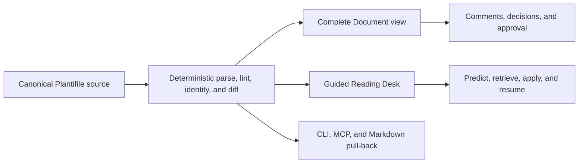
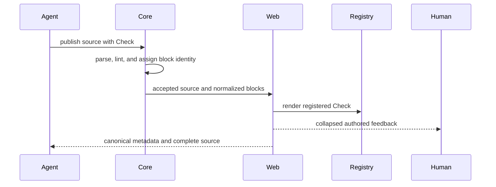

# Plantifile Artifact Specification

Status: proposed revision for planning plus teaching/learning artifacts.

This specification changes Plantifiles from “formatted plan Markdown” into a source-first understanding artifact: agents author evidence, decisions, explanations, checks, and execution gates once; humans can read it as a document or move through it as a guided experience; agents still pull the complete source back into a build session.

Normative terms use MUST, SHOULD, and MAY as defined by RFC 2119.

## 1. Product thesis

A Plantifile is a durable interface between agent reasoning and human understanding.

It has three simultaneous representations:

1. **Source:** deterministic Markdown plus a closed component vocabulary. This is canonical, versioned, diffable, commentable, and useful without JavaScript.
2. **Document:** the complete editorial reader used for review, source inspection, and reference.
3. **Guided view:** a learner-paced projection of the same source that targets orientation, retrieval, feedback, and task re-entry without changing or withholding the source.



The product wins when a reader can answer all three questions:

- What are we changing, why, and how will we prove it?
- What must I understand to judge or execute that change?
- Where was I, what did I establish, and what should I do next?

“Engagement” means reaching a self-declared understanding or execution goal. It does not mean maximizing dwell time, clicks, sessions, or content consumption.

## 2. Goals and non-goals

### 2.1 Goals

Plantifiles MUST:

- produce evidence-backed implementation plans with explicit decisions, invariants, phases, gates, and rollback;
- teach the minimum domain knowledge a reader needs to evaluate or execute the artifact;
- make active recall, application, and elaborated feedback first-class authoring moves;
- support short, purpose-led chunks and frictionless re-entry after interruption;
- provide visual and interactive presentation without allowing authors to ship arbitrary presentation code;
- remain complete and useful in pulled source, copied text, assistive technology, and failed-hydration states;
- keep review state, implementation state, and personal learning state semantically separate;
- preserve stable block identity across versions for comments, decisions, diffs, and progress reset;
- be deterministically parseable and lintable without a model call.

### 2.2 Non-goals

This revision is not:

- a general LMS, course marketplace, or credential system;
- an executable notebook or arbitrary HTML/JavaScript host;
- a replacement for running the real program or observing real implementation evidence;
- a quiz engine that claims to measure mastery;
- a personalized curriculum inferred from diagnosis, age, generation, browsing behavior, or a supposed learning style;
- a gamified retention loop built from points, badges, streaks, leaderboards, timers, variable rewards, or nagging notifications;
- a license to pad plans with textbook material unrelated to a decision or phase.

The prior `<Prototype>` experiment is explicit evidence against arbitrary embeds: `DECISIONS.md:47-52` records the security surface created by iframe hosting, sanitization, runtime styling, and unsafe-content handling, followed by its removal. Interactive Plantifiles MUST use house-owned renderers over a closed grammar instead.

## 3. Design basis

The design is grounded in two evidence classes.

### 3.1 Repository facts

- `packages/core/src/syntax.ts:parseSource` already parses Markdown, GFM, YAML frontmatter, and restricted MDX into one AST.
- `packages/core/src/lint.ts:analyzePlan` already provides deterministic grammar, publication findings, score, and normalized blocks.
- `packages/core/src/normalize.ts:normalizeParsedSource` treats each root AST node as a stable review block, using an explicit `id` when present and otherwise deriving identity from heading path, kind, and ordinal.
- `apps/web/src/routes/p/$workspaceSlug/$planSlug/-data/compile-plan.server.ts:compilePlan` compiles canonical source into serializable HAST and annotates root blocks.
- `apps/web/src/routes/p/$workspaceSlug/$planSlug/-components/plan-render.tsx` permits only registered elements and rejects executable expressions, imports, exports, and unknown elements.
- `apps/web/src/lib/data/plan-reader.server.ts:renderPlanMarkdown` preserves the authored body but replaces author frontmatter with canonical product metadata for agent pull-back. The target contract must extend that canonical metadata.
- Existing `TLDR`, section summaries, shallow headings, diagrams, code sketches, tradeoffs, risks, phases, comments, decisions, and structural diffs already support skimming and review.

Therefore the root-block interface remains the seam. This revision adds a profile switch, one pedagogical block, and browser projections. It does not create a second document engine.

### 3.2 Learning and accessibility evidence

The full source review is `RESEARCH-LEARNING-ARTIFACTS.md`. Load-bearing findings:

- Retrieval practice outperforms restudy by about a medium effect, and feedback substantially strengthens it ([Adesope et al. 2017](https://doi.org/10.3102/0034654316689306); [Rowland 2014](https://doi.org/10.1037/a0037559)).
- Elaborated computer feedback outperforms bare right/wrong verification ([Van der Kleij et al. 2015](https://doi.org/10.3102/0034654314564881)).
- Worked examples help novices, while redundant guidance can hurt experts ([Sweller and Cooper 1985](https://doi.org/10.1207/s1532690xci0201_3); [Kalyuga et al. 2003](https://doi.org/10.1207/S15326985EP3801_4)).
- Learner-paced segmenting helps; unrestricted control over curriculum order has near-zero average benefit ([Rey et al. 2019](https://doi.org/10.1007/s10648-018-9456-4); [Karich et al. 2014](https://doi.org/10.3102/0034654314526064)).
- Interesting but irrelevant graphics, stories, and animation can reduce retention and transfer ([Rey 2012](https://doi.org/10.1016/j.edurev.2012.05.003)).
- W3C cognitive accessibility guidance calls for clear purpose, familiar controls, small chunks, visible process position, minimal interruption, and support for reorientation after distraction ([W3C COGA](https://www.w3.org/TR/coga-usable/design_guide.html)).
- WCAG 2.2 requires timing control, controllable movement, descriptive labels, and consistent navigation; interaction-triggered animation must respect user needs ([WCAG 2.2](https://www.w3.org/TR/WCAG22/)).

These findings support attention-variable design. They do not establish that Plantifiles treats ADHD or that one interaction works for every person. The cited studies evaluated human-authored learning materials; applying their findings to agent-authored artifacts is an inference that Section 13 must validate. The product MUST NOT infer or expose a diagnosis.

## 4. Artifact profiles

The same parser, root-block model, and closed vocabulary support three profiles. A profile changes required structure and reader projection, not component meaning.

| `kind` | Reader job | Required structure | Planning requirements |
|---|---|---|---|
| `plan` | Decide and execute a change | Plan requirements | Required |
| `lesson` | Understand and practice a topic | Audience, outcomes, and retrieval/transfer checks | Not required |
| `guided-plan` | Understand, judge, and execute a change | Strict plan contract plus learning requirements | Required |


### 4.1 Frontmatter

```yaml
---
title: string
kind: plan | lesson | guided-plan
emoji: string
audience: string
outcomes:
  - observable outcome
---
```

Rules:

- `title` and `kind` are required. Missing, empty, or unknown values are lint errors.
- `kind` MUST be `plan`, `lesson`, or `guided-plan`.
- Title authority follows the publication path: on creation, an explicit API or CLI `--title` value wins, otherwise CLI uses source frontmatter, then the filename fallback. Later source versions do not rename the product record. Pulled canonical frontmatter always emits the stored product title.
- `audience` MUST state assumed prior knowledge in one line for `lesson` and `guided-plan`. It MAY appear on `plan`.
- `outcomes` MUST contain one to five observable “can explain, compare, predict, trace, review, or perform” statements for `lesson` and `guided-plan`. It MAY appear on `plan`.
- Outcomes such as “understand X” or “learn Y” SHOULD produce a warning because they do not name observable behavior.
- Authored frontmatter accepts only the fields defined here. Canonical read-only metadata added during pull-back is ignored when republished and cannot change renderer behavior.

### 4.2 Profile behavior

All profiles share Markdown and the full closed component vocabulary. A block keeps the same semantics in every profile; profiles change requirements rather than inventing aliases.

`plan` requires the planning rules in Sections 6.1, 6.2, and 11.1. It MAY contain a `<Check>`, but a plan with declared outcomes and Checks SHOULD receive a warning recommending `guided-plan`.

`lesson` does not require Decision, Phase, or Diagram. It errors when either a retrieval Check (`predict` or `recall`) or a transfer Check (`apply` or `reflect`) is missing. A meaningful visual or concrete artifact remains a review requirement, not a component-presence lint rule. Planning blocks used to teach a comparison, risk, or delivery mechanism retain their normal semantics.

`guided-plan` MUST satisfy every plan error and every learning error. Teaching attaches to the plan’s real diagrams, code sketches, tradeoffs, decisions, and phases rather than duplicating them in a lesson appendix.

## 5. Authoring interface

### 5.1 Existing planning vocabulary

The existing ten components remain unchanged: `TLDR`, `Decision`, `Tradeoff` with nested `Option`, `Rejected`, `Phase`, `Risk`, `Diagram`, `CodeSketch`, and `Callout`.

Existing component IDs remain the identity mechanism. Important blocks MUST receive explicit IDs and keep them unchanged across edits.

### 5.2 New `<Check>` component

One new root component supplies prediction, retrieval, application, and reflection.

```mdx
<Check
  id="stable-id"
  kind="predict|recall|apply|reflect"
  prompt="A direct question of at most forty words"
  for="optional-explicit-block-id"
>
**Answer:** A concise expected answer.

**Why:** An explanation of the mechanism, evidence, misconception, or consequence.

**Next:** An optional concrete action when the learner’s answer differed.
</Check>
```

Contract:

- `id`, `kind`, and `prompt` are required.
- `id` follows the existing unique ID rule.
- `prompt` MUST be plain text, nonempty, and at most 40 words.
- `kind` has exactly four values:
  - `predict`: commit before seeing the explanation;
  - `recall`: retrieve a fact, relationship, or mechanism after study;
  - `apply`: use the concept on a new case, code path, or failure;
  - `reflect`: explain a decision or remaining uncertainty in the learner’s own words.
- `for` is optional. When present, it MUST resolve within the same document to another top-level component’s explicit ID and cannot target the Check itself. Headings and prose are not valid targets because the current identity interface exposes explicit IDs only on components.
- The body is canonical feedback. It MUST contain `**Answer:**` and `**Why:**` paragraphs. `**Next:**` is optional. For `reflect`, Answer states criteria or a representative response rather than pretending there is one correct wording.
- The answer MUST explain the task or process, not praise or evaluate the person.
- The browser MAY collect a private draft response before reveal. It MUST NOT call a response correct unless deterministic evaluation is specified by a future Check capability admitted under Section 5.4. Deterministic evaluation is that section’s reserved first candidate and MUST NOT arrive as a parallel question component.
- The full prompt, answer, explanation, and next step remain visible in source. Browser concealment is a presentation enhancement, not access control.

Free recall is the default. This revision intentionally does not add choices, scoring, attempts, hints, or question banks. Multiple-choice syntax adds authoring and feedback surface while usually eliciting recognition rather than recall.

### 5.3 Teaching patterns without new syntax

Agents MUST reuse the existing artifact vocabulary before requesting new components.

- **Concept model:** short section summary plus a Mermaid data, state, sequence, or lifecycle diagram.
- **Worked example:** `CodeSketch` or fenced command/output with prose explaining each consequential step.
- **Faded practice:** full worked example, then a partially specified case, then `<Check kind="apply">`.
- **Comparison:** `Tradeoff` plus `<Check kind="predict">` before the recommendation or `<Check kind="recall">` after it.
- **Failure rehearsal:** `Risk` plus a check asking the reader to predict the observable failure and mitigation.
- **Execution practice:** `Phase` with explicit gate and rollback, followed by an apply check against a changed input or failure path.
- **Teach-back:** `<Check kind="reflect">` asking the reader to explain the mechanism to a teammate or agent.

No rule requires every pattern. Authors choose the smallest set that defends the outcomes and likely misconceptions.

### 5.4 Extension admission contract

The component vocabulary is closed but not frozen. A new component or Check capability is admitted only by revision of this specification and only when it satisfies every test:

- **House-implemented in one slice:** core vocabulary, deterministic lint rules with declared severities, registry renderer, review behavior, and skill guidance ship together. Runtime plugins, author-supplied renderers, and configuration-driven behavior remain prohibited.
- **Complete in plain text:** the authored body is canonical content and interactivity is projection only. A reader of pulled Markdown loses no information. A component whose meaning lives in a behavior schema rather than readable prose fails admission.
- **Deterministically lintable:** exact prop allowlist, literal values, placement, and body grammar are checkable without a model call.
- **Identified and diffable:** the capability remains a root-level, explicit-ID block meaningful under structural diff and block-anchored comments.
- **State-classified:** every reader state maps to a Section 9 domain. New personal state is local, version-scoped, and never mutates review or workflow state.
- **Accessible and non-manipulative:** the implementation satisfies Section 8.4, including keyboard and non-visual equivalents for pointer interaction, and violates none of Section 12.
- **Evidenced demand or normative necessity:** either (a) at least three published artifacts from at least two independent authors—distinct human principals, not one operator’s agents or one skill template’s instructed prose—spontaneously approximate the same interaction in prose; or (b) a requirement of Section 8.4, 10, or 12, or of an external normative standard, is demonstrated to be unsatisfiable by both the closed vocabulary and a lint-preconditioned projection. Every proposal names the Section 13 measure it should improve and the prose-approximation baseline it is compared against.

No component or Check capability beyond those defined by this revision is admitted before the Stage 4 gate settles, except an admission under clause (b), which still satisfies every other test in this section. In-artifact execution cannot enter through this section: reconsidering a house-owned runner requires a separate top-level amendment to this specification with its own safety and evidence argument, and author-supplied execution remains prohibited under Section 2.2.

## 6. Required document shapes

### 6.1 Common structure

Every profile follows explicit structural and review rules:

| Rule | Enforcement |
|---|---|
| One `TLDR` first, at most 60 words | Existing lint error |
| Each level-two section opens with a one-line purpose summary of at most 30 words | Existing lint error |
| Headings go no deeper than level three | Existing lint error |
| Paragraphs stay within 120 words and five sentences | Existing lint error |
| Any paragraph above 60 words in `lesson` or `guided-plan` | Warning |
| Linear read time above 12 minutes, calculated from AST text at 200 words per minute | Warning; authors SHOULD split oversized material manually |
| Prompts, feedback, diagrams, code, gates, and rollback remain complete in source | Renderer invariant plus review |
| A meaningful visual or concrete artifact supports any process, relationship, state, data shape, or code interface that prose obscures | Reviewed, not machine-enforced |

A decorative image does not satisfy the artifact requirement.

### 6.2 Plan requirements

`plan` and `guided-plan` requirements use explicit enforcement classes:

| Requirement | Enforcement |
|---|---|
| Verified facts and labeled inferences | Reviewed, not machine-enforced |
| At least one real unresolved `Decision` with accountable owner | Presence and owner are existing errors; whether the question is real is reviewed |
| A `Tradeoff` when viable alternatives exist, with exactly one recommendation | Necessity is reviewed; shape is an existing error when present |
| At least one `Rejected` alternative | Existing warning |
| Explicit invariants | Reviewed, not machine-enforced |
| At least one `Diagram` revealing ordering, ownership, state, or failure | Presence is an existing error; explanatory value is reviewed |
| Observable, reversible `Phase` blocks with tasks, Gate, and Rollback | Phase presence is an existing error; Gate/Rollback labels are new errors for explicit plan profiles; observability and rollback credibility are reviewed |
| Named callers and obsolete paths for clean cutover | Reviewed, not machine-enforced |
| Risks with severity and mitigation | Presence and mitigation are reviewed; severity is an existing error when a Risk is present |

Lint proves only the named structural facts. It MUST NOT claim to prove evidence quality, decision validity, visual meaning, phase observability, or rollback feasibility.

### 6.3 Learning requirements

`lesson` and `guided-plan` MUST:

- declare audience and outcomes;
- state the practical payoff before background detail;
- include at least one retrieval-oriented Check (`predict` or `recall`);
- include at least one transfer-oriented Check (`apply` or `reflect`);
- place feedback in the artifact; bare right/wrong feedback is invalid;
- tie every Check to a declared outcome in authoring review, even when `for` points to a block rather than an outcome;
- avoid forcing expert readers through novice scaffolding by labeling optional prerequisite sections clearly;
- end with a short recap: outcomes revisited, unresolved uncertainty, and the next real action.

A check is not decorative. If the answer is copied verbatim from the preceding sentence and requires no retrieval, inference, comparison, or application, authoring review MUST reject it.

## 7. Authoring workflow for agents

Agents producing `guided-plan` or `lesson` artifacts follow this sequence.

### 7.1 Establish authority

- Read the request, repository instructions, current implementation, callsites, tests, public contracts, and runtime evidence.
- Separate sourced facts, repository facts, observations, inferences, and recommendations.
- Do not teach an inferred architecture as fact.

### 7.2 Model the reader

Record:

- what the reader is trying to decide or do;
- what prior knowledge is safe to assume;
- the smallest set of concepts needed for the outcomes;
- likely misconceptions with implementation consequences;
- which details an experienced reader may skip.

Do not infer diagnosis, generation, or learning style.

### 7.3 Build the dependency spine

Order material as:

1. payoff and outcomes;
2. current mental model or pretest;
3. concise explanation with a real artifact;
4. retrieval with elaborated feedback;
5. application to a changed case;
6. execution phase or next real action;
7. recap and unresolved uncertainty.

The author controls curriculum order. The reader controls pace and may skip freely.

### 7.4 Review for coherence

Delete:

- repeated prose that an artifact already makes visible;
- “fun facts,” decorative anecdotes, and unrelated visuals;
- generic praise and motivational filler;
- checks with obvious copy/paste answers;
- background knowledge not used by a decision, risk, outcome, or phase;
- arbitrary customization that the house renderer can derive.

### 7.5 Lint, preview, and publish

Before lint, the authoring skill MUST verify a nonempty title and explicit kind for new artifacts. The source MUST then pass profile-aware deterministic lint. The agent MUST inspect both Document and Guided views and MUST pull the published Markdown once to verify that the complete artifact survives without the interactive layer.

## 8. Browser experience

### 8.1 Canonical Document view

Document remains the review and reference surface. It renders every source block in order with comments, decision resolution, versions, structural diff, source disclosures, and provenance.

Checks render their prompt openly and their Answer, Why, and Next inside a labeled, collapsed-by-default disclosure. Reviewers can reveal the complete authored feedback immediately. No information is removed from Document view.

### 8.2 Guided “Reading Desk” view

The primary learning projection is a progressive reading desk, not a slide deck or game board.

- Orientation is the `TLDR`, audience, and outcomes.
- Each level-two heading becomes one source-ordered step.
- The required section summary is the step preview and re-entry cue.
- Selecting a step renders its original blocks, anchors, comments, decision state, diagrams, and code.
- A Check first shows its prompt and an optional private response field. “Reveal authored answer” exposes Answer, Why, and Next.
- Previous, next, full path, and Document controls remain available. Nothing is locked.
- A fragment link opens the containing step and focuses the original block.
- If projection fails, the application falls back to Document without data loss.

The renderer MAY offer a phase-focused “Field Guide” only when deterministic lint finds `**Gate:**` and `**Rollback:**` paragraphs in every Phase. It MUST NOT infer dependencies, evidence, or correctness from prose at render time.

A spatial concept map MAY be a secondary overview for relationship-rich artifacts. It MUST use source structure and explicit links only, provide an equivalent semantic outline, and never become the sole reader.

This is the general pattern for new interactions: the renderer MAY add a projection only when deterministic lint proves the structure it needs, it MUST NOT infer meaning from prose at render time, and it MUST fall back to Document without data loss. A projection introduced before Stage 4 uses existing source structure only, names its own Section 13 outcome at introduction, and is evaluated and removed independently under the Stage 4 gate; this applies to the Field Guide and the concept map above.

### 8.3 Visual direction

Eye candy comes from semantic information design:

- stable typography and hierarchy;
- a visible source-ordered path;
- themed diagrams and code figures;
- risk, decision, tradeoff, and phase semantics;
- restrained disclosure and focus treatments;
- immediate, task-specific feedback.

It does not come from unrelated animation, mascots, collectible decorations, theme galleries, or author-controlled CSS. The existing Sprout token system and house registry own presentation.

### 8.4 Accessibility

The reader MUST:

- work at 320 CSS pixels without page-level horizontal scrolling, except within inherently spatial artifacts;
- expose the guided path as semantic navigation with descriptive labels and `aria-current`;
- implement disclosures with native controls or WAI-ARIA Authoring Practices behavior;
- keep visible keyboard focus and logical focus order;
- avoid scroll hijacking, autoplay, auto-advance, swipe-only navigation, and time limits;
- honor `prefers-reduced-motion`; state changes remain understandable without animation;
- never hide critical choices or completed-path context inside an unlabeled disclosure;
- preserve headings, prompts, answers, and progress meaning without color alone;
- allow immediate exit to Document and reset of personal state.

## 9. State model

Plantifiles have four distinct state domains.

| Domain | Examples | Authority | Version behavior |
|---|---|---|---|
| Content | source, block IDs, authored Phase checkboxes | Published artifact version | Immutable per version; changing a checkbox publishes a version |
| Review | comments, decision resolutions, approvals | Shared server state | Anchored to block/version rules |
| Workflow | plan lifecycle | Shared team state | Never changed by reading |
| Personal learning | active section, draft response, revealed/revisit marks | Reader-local state by default | Scoped to artifact version |

Personal Check state is `unseen`, `attempted`, `revealed`, or `revisit`. These labels describe interaction, not correctness or mastery.

Personal state MUST NOT:

- resolve decisions;
- check Phase tasks;
- approve a version;
- advance plan lifecycle;
- be visible to teammates by default;
- survive into a new version as claimed understanding.

A new version MAY map the last stable block ID to its corresponding section and say “Continue near your previous place.” It MUST reset attempted/revealed labels when the target block’s content hash changed.

Learner responses remain local unless the reader explicitly copies, exports, or posts one as a review comment. The UI must name the destination before sharing.

## 10. Plain-text and agent contract

The source is complete teaching material, not a serialization of browser state.

When pulled by CLI, MCP, or Markdown content negotiation:

- canonical frontmatter includes `kind`, `audience`, and `outcomes` in addition to existing product metadata; the negotiated Markdown implementation MUST be extended because it currently replaces author frontmatter without those fields;
- prompts, answers, explanations, diagrams, code, gates, and rollback remain present in the authored body;
- `**Answer:**` is the plain-text spoiler boundary: human readers can pause at the prompt, while agents and reviewers retain complete feedback;
- private responses and personal progress are absent unless explicitly exported;
- no renderer-generated summary replaces authored source;
- identical stored source yields identical pulled body bytes under the existing canonical metadata rules.

An agent consuming a Plantifile SHOULD use outcomes and Checks as an execution-time knowledge contract: before changing a phase, it can ask the human the linked prediction or explain the relevant answer, but it MUST NOT block work on an unrequested quiz.

## 11. Lint and quality model

Lint validates syntax and structural minimums. It does not certify learning.

### 11.1 Deterministic lint

The revised linter MUST add:

- profile-aware required-component errors using the exact profile rules in Section 4.2;
- required frontmatter type and enum errors;
- Check prop allowlist, literal-value, placement, ID, prompt-length, and nonempty-body errors;
- required Answer and Why label errors;
- `for` reference-resolution and no-self-reference errors;
- missing retrieval-Check and transfer-Check errors for learning profiles;
- audience and outcome errors plus 60-word paragraph warnings for lesson/guided profiles;
- `**Gate:**` and `**Rollback:**` Phase errors for `plan` and `guided-plan`;
- exact prop allowlist and literal-value errors for every custom component;
- fence-language agreement errors for Diagram and CodeSketch;
- findings that state whether a rule is machine-enforced or review-only;
- the existing 200-words-per-minute read-time warning unchanged.

The safe renderer remains a second defense. Force-publish MUST never enable unknown elements, expressions, scripts, arbitrary URLs, or privileged DOM prop spreading.

### 11.2 Human/agent quality review

Review scores six independent questions:

1. **Grounding:** Are claims tied to repository evidence, primary sources, or labeled inference?
2. **Planning:** Are decisions real, invariants explicit, phases observable, and rollback credible?
3. **Teaching:** Do explanations build the smallest correct mental model?
4. **Practice:** Do Checks require retrieval or transfer and provide task-level explanations?
5. **Coherence:** Does every artifact serve an outcome, decision, risk, or phase?
6. **Accessibility and integrity:** Can a reader re-enter, skip, reduce motion, use plain text, and avoid manipulation?

A high lint score with weak answers to these questions is a structurally valid but low-quality Plantifile.

## 12. Ethical engagement contract

The renderer and authoring skill MUST prohibit:

- points, XP, levels, badges, trophies, leaderboards, peer ranking, or “top learner” labels;
- streaks, streak-loss warnings, artificial daily goals, countdowns, limited attempts, lives, or expiring access;
- confetti, loot, variable rewards, surprise unlocks, or celebration loops contingent on continued use;
- forced sequencing, blocked future sections, or shame/loss-framed copy;
- autoplay tours, scroll hijacking, infinite recommendations, and nagging notifications;
- scroll, dwell time, disclosure opening, or viewport entry presented as comprehension;
- hidden telemetry, attention tracking, or diagnosis/personality inference;
- praise-only feedback or language evaluating the learner’s identity;
- interactive-only explanations unavailable in source.

Neutral position and re-entry information is allowed: “Section 2 of 5,” “last opened: failure recovery,” and “one Check marked revisit.”

## 13. Measurement and validation

The product MUST validate the revision against Markdown baseline rather than assume interactivity helps.

Primary measures:

- immediate and delayed recall of the artifact’s core mechanism;
- transfer to a changed code or failure scenario;
- accuracy when reviewing a real decision or predicting a real failure;
- time and actions required to resume after a deliberate interruption;
- implementation deviation from named gates and invariants;
- learner-declared usefulness and cognitive burden;
- successful use with keyboard, reduced motion, narrow viewport, screen reader, and pulled source.

Guardrail measures:

- no increase in incorrect confidence;
- no conflation of reading state with approval or implementation state;
- no regression in agent pull-back completeness;
- no optimization for dwell time or repeated visits;
- no disproportionate failure for readers who skip guided mode.

A valid evaluation compares the same content in Document and Guided views. If Guided improves clicks but not recall, transfer, review quality, or re-entry, the interaction failed.

## 14. Migration and release gates

### Stage 1: static profile pilot

Implement the minimum end-to-end slice required to publish the new source: required profile parsing, profile-scoped components, the Check vocabulary entry, a static collapsed Check renderer, canonical pull-back metadata, and the downloadable skill.

Gate: five internal artifacts—at least two lessons and two guided plans—render safely, remain complete when pulled, and pass expert review without Reading Desk state.

### Stage 2: complete lint and renderer contract

Add the full Check body/reference rules, explicit-profile prop schemas, Phase gate/rollback rules, and contract tests at the existing parser/renderer seam.

Gate: plan, lesson, and guided-plan fixtures enforce their exact rules; unknown or unsafe syntax fails at lint and render; Check source and rendered feedback match.

### Stage 3: Reading Desk

Add the source-derived guided projection and version-scoped local state.

Gate: keyboard, narrow viewport, reduced motion, fragment links, comments, decision actions, failure fallback, and Markdown pull-back all preserve current behavior.

### Stage 4: learning validation

Run interruption/re-entry, recall, and transfer studies against Document baseline using real technical artifacts.

Gate: Guided view improves at least one declared learning or re-entry outcome without harming review accuracy, accessibility, source completeness, or user control. Otherwise keep Document plus static Check and remove the ineffective projection.

Projections are gated individually: each passes on its own named outcome or is removed without affecting the others.

## 15. Rejected alternatives

### Full LMS schema

Courses, modules, prerequisites, enrollments, grades, mastery models, and schedules would move the seam away from a durable engineering artifact. They add a learner-account system before the core teaching loop is proven.

### Rewrite the ten-component vocabulary around pedagogy

Replacing `Decision`, `Tradeoff`, `Risk`, and `Phase` with abstract “orient/predict/reveal/apply” blocks is elegant for lessons but weakens the planning interface, migration path, structural diff continuity, and engineering meaning already present in source.

### Many specialized learning components

Separate Concept, Objective, Quiz, Choice, Hint, Solution, Flashcard, Mission, Reflection, and Progress components create a large shallow authoring interface. One Check plus existing artifacts gives the renderer most of the leverage while keeping correct use teachable.

This rejection is scoped to the initial vocabulary, not permanent doctrine. Section 5.4 defines the admission path when independent artifact evidence or normative necessity proves that existing source and projections are insufficient.

### Arbitrary interactive embeds

HTML, scripts, iframes, remote widgets, and author-supplied React maximize novelty but lose deterministic safety, source parity, accessibility consistency, house visual identity, and long-lived reviewability. The repository has already paid and removed this cost.

### Reward-driven gamification

Points, streaks, badges, and leaderboards can increase activity while undermining intrinsic motivation and teaching readers to optimize the reward proxy. The artifact’s real decisions, risks, predictions, code, and observable results are the challenge and feedback loop.

### AI-generated feedback at read time

Runtime generation makes the artifact nondeterministic, unreviewed, hard to cite, unavailable in plain text, and capable of contradicting approved source. Agents author feedback before publication; future conversational help may quote and explain that source but must be explicitly invoked and clearly marked.

## 16. Representative guided-plan source

This example uses verified paths from the current repository so its evidence and migration shape are concrete rather than fictional.

````mdx
---
title: Add guided knowledge checks to Plantifiles
kind: guided-plan
emoji: "..."
audience: Plantifiles maintainers who understand Markdown ASTs but have not traced the restricted renderer
outcomes:
  - Trace a new block from source through lint and rendering
  - Explain why feedback must remain in canonical source
  - Verify all three document profiles enforce their exact contracts
---

<TLDR id="summary">
Add one source-complete Check block and three required profiles, then prove the parser, linter, renderer, and pull-back path agree.
</TLDR>

## Evidence

The current source contract shows exactly where a new root block must be recognized and defended.

### Verified facts

- `packages/core/src/types.ts:COMPONENT_NAMES` lists the ten currently accepted components and does not include Check.
- `packages/core/src/lint.ts:analyzePlan` applies Decision, Phase, and Diagram requirements globally.
- `apps/web/src/routes/p/$workspaceSlug/$planSlug/-components/plan-component-registry.tsx:planComponents` has no Check renderer.
- `apps/web/src/lib/data/plan-reader.server.ts:renderPlanMarkdown` replaces author frontmatter with canonical metadata.

### Inferences

- **Inference:** Adding Check to the browser registry without core vocabulary support still blocks ordinary publication. Prove this with the profile contract tests before the static pilot gate.

<Check id="predict-one-sided-change" kind="predict" prompt="What happens if Check is added only to the browser registry?">
**Answer:** The core linter still reports an unknown component, so an ordinary publish never reaches that renderer.

**Why:** Source acceptance and rendering are separate defenses. A new component must cross both seams in one end-to-end slice.

**Next:** Enumerate the parser, linter, normalizer, registry, review, and pull-back assertions before editing.
</Check>

<Diagram id="artifact-pipeline" lang="mermaid">

</Diagram>

<Check id="recall-source-contract" kind="recall" for="artifact-pipeline" prompt="Why must the Check answer live in source instead of browser state?">
**Answer:** Source is the versioned, reviewed representation shared by humans and agents; browser state is personal and optional.

**Why:** A browser-only answer disappears from CLI, MCP, Markdown pull-back, diffs, comments, and failed-hydration fallbacks.
</Check>

## Design and delivery

Ship the smallest static contract before adding personal state or a guided projection.

<Decision id="response-sync" owner="@plantifiles">
Should a future release keep learner responses local-only, or offer an explicit post-as-comment action?
</Decision>

<Tradeoff id="rollout-shape">
<Option name="Static Check before Reading Desk" recommended>
This proves source, lint, identity, rendering, and pull-back before adding personal progress state.
</Option>
<Option name="Ship the complete guided view at once">
This demonstrates more visual impact, but a failure cannot be localized to grammar, renderer, or state.
</Option>
</Tradeoff>

<Rejected id="arbitrary-learning-widgets" what="Author-supplied HTML and scripts">
They recreate the removed Prototype security surface and make accessibility, source parity, and house presentation author-controlled.
</Rejected>

### Invariants

- Every document declares exactly one valid profile and receives that profile’s rules.
- Check feedback is authored, reviewable, and byte-present in pulled source.
- Unknown elements and executable MDX remain rejected at runtime even after force-publish.
- Personal response state never mutates source checkboxes, decisions, approvals, or lifecycle.

<Phase id="phase-static-check" n="1" title="Prove the static Check contract">
- [ ] Add Check to `packages/core/src/types.ts` and profile-aware rules to `packages/core/src/lint.ts`
- [ ] Add the static renderer through `plan-component-registry.tsx` and the existing review wrapper
- [ ] Extend `renderPlanMarkdown` canonical metadata with kind, audience, and outcomes
- [ ] Exercise all three profiles plus malformed body, dangling `for`, and unknown-element cases

**Gate:** The named contract cases pass, a published Check is commentable and collapsed in Document, and a pulled artifact contains identical prompt and feedback text.

**Rollback:** Revert the clean-cutover slice and redeploy the last internal build; no launched client or compatibility promise exists.
</Phase>

<Check id="apply-safe-adapter" kind="apply" for="phase-static-check" prompt="A Check adapter spreads every authored prop onto its button. Which invariant is violated?">
**Answer:** Author source gains control of privileged DOM attributes instead of passing through a closed adapter interface.

**Why:** Forced publication bypasses ordinary lint findings, so the renderer must destructure known props and remain an independent safety defense.

**Next:** Accept only id, kind, prompt, for, blockKey, and children; map them to house-owned markup.
</Check>

<Risk id="profile-loss" severity="high">
Canonical Markdown currently replaces author frontmatter. If kind, audience, and outcomes are not added there, pulled guided plans silently become ordinary plans for the next agent.
</Risk>

## Recap

The new block crosses the existing source seam once and keeps feedback durable for both humans and agents.

- **Outcomes revisited:** trace Check through core and registry; keep feedback in source; prove all three profile contracts.
- **Unresolved uncertainty:** the `response-sync` decision owns whether sharing a private response becomes an explicit future action.
- **Next real action:** implement and exercise the static Check contract in `phase-static-check` before building Reading Desk state.
````

This example demonstrates the intended contract: repository evidence precedes design, planning semantics remain intact, knowledge changes a real gate, Checks use retrieval and task-specific explanation, and the source stays complete.