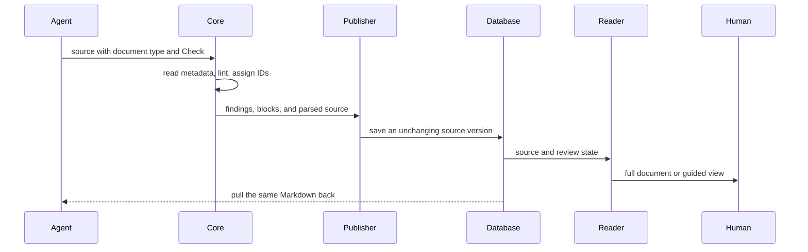
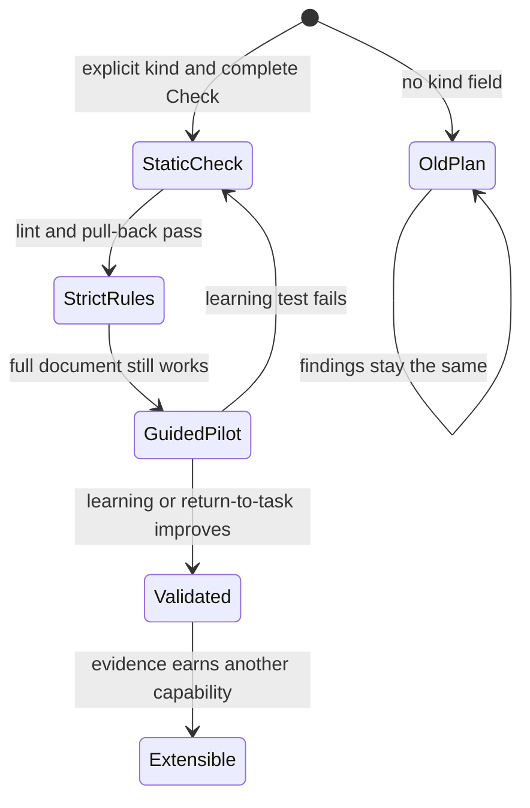

<TLDR id="plan-summary">
Replace the current grammar with three document types and one Check block, then test whether the guided reader actually helps people learn.
</TLDR>

## Learn the idea

Plantifiles keeps one trusted source and can show that source in different ways.

### Five things to remember

1. **The source is the truth.** The Markdown holds the plan, questions, answers, IDs, and evidence.
2. **The document type chooses the rules.** `plan`, `lesson`, and `guided-plan` use the same blocks but require different content.
3. **Check is the quiz block.** It asks you to predict, remember, apply, or explain before showing Answer, Why, and optional Next guidance.
4. **Views change presentation, not meaning.** Reading Desk and Field Guide rearrange the source but never replace it.
5. **New blocks must earn their place.** We add one only after repeated real demand or a clear accessibility or safety need.

<Check id="predict-one-sided-change" kind="predict" prompt="What happens if the browser supports Check but packages/core does not?">
**Answer:** Publishing fails before the browser sees the Check.

**Why:** `packages/core/src/lint.ts:analyzePlan` rejects unknown components first, so parser, linter, IDs, renderer, pull-back, and skill must change together.

**Next:** Trace the component through each layer before editing.
</Check>

<Diagram id="source-authority-flow" lang="mermaid">

</Diagram>

## What exists today

The current code already has one place that reads, checks, and prepares every plan.

### Verified facts

- `packages/core/src/types.ts:COMPONENT_NAMES` lists the ten currently allowed blocks. Check is not there yet.
- `packages/core/src/lint.ts:analyzePlan` parses the source, creates blocks, reports problems, and requires Decision, Phase, and Diagram.
- `packages/core/src/normalize.ts:normalizeParsedSource` gives each root block an ID, content hash, heading path, and position.
- `apps/web/src/lib/data/publish-plan.server.ts:assertPublishableSource` blocks bad publications. `createPlan` and `createPlanVersion` save source, blocks, and decisions together.
- `apps/web/src/routes/p/$workspaceSlug/$planSlug/-data/compile-plan.server.ts:compilePlan` prepares the same parsed source for the browser.
- `apps/web/src/routes/p/$workspaceSlug/$planSlug/-components/plan-component-registry.tsx:planComponents` lists what the browser is allowed to render.
- `apps/web/src/lib/data/plan-reader.server.ts:renderPlanMarkdown` removes the author’s frontmatter and writes trusted product metadata before the body.
- `apps/cli/src/index.ts:titleFromSource` gets a new plan’s title from frontmatter or the filename. Later version pushes do not rename the plan.

### Tests that protect the current behavior

- `packages/core/src/lint.test.ts` — “accepts a document meeting every lint rule” plus the placement, ID, severity, and warning tests protect the grammar.
- `packages/core/src/core.test.ts` — “keeps block keys stable when content changes under the same heading path” and “classifies added, removed, modified, and moved blocks” protect comments and version history.
- `apps/web/src/routes/p/$workspaceSlug/$planSlug/-components/plan-render.test.tsx` — “renders the complete plan component vocabulary without code generation” and the unknown-element tests protect the browser.
- `apps/web/src/lib/data/data-contract-harness.test.ts` — “publishes plan, version, blocks, and decisions atomically” and the approval test protect publishing and review.
- `packages/api-client/src/index.test.ts` — “requests Markdown through the same authenticated transport” protects agent pull-back.

### Things we still need to prove

- **Inference:** We can keep document type, audience, and outcomes in source instead of adding database columns. Prove that a publish-and-pull round trip keeps them.
- **Inference:** Local browser storage is enough for the first Reading Desk. Prove that a person can leave, return, and continue easily.
- **Inference:** One root Check block is the right comment and diff unit. Prove that comments survive edits before adding smaller answer IDs.

<Diagram id="artifact-lifecycle" lang="mermaid">

</Diagram>

## How we build it

Keep one function in charge so publishing and rendering cannot disagree.

### One shared interface

Keep `analyzePlan(source, options)`. Make it return the document type and learning metadata along with the blocks and lint report. Callers should not parse frontmatter or choose rules themselves.

<CodeSketch id="analysis-interface" lang="ts" file="packages/core/src/types.ts">
```ts
export type ArtifactProfile = "plan" | "lesson" | "guided-plan";

export type ArtifactMetadata = {
  profile: ArtifactProfile;
  explicitKind: boolean;
  title?: string;
  audience?: string;
  outcomes: string[];
};

export type PlanAnalysis = {
  metadata: ArtifactMetadata;
  blocks: Block[];
  report: LintReport;
  canPersist: boolean;
  tree?: Root;
};
```
</CodeSketch>

`publish-plan.server.ts` uses this result to decide whether it can publish. `compile-plan.server.ts` uses the same result to render safely. Both paths therefore follow the same rules.

### Rules we cannot break

- Every document has a valid `kind` and gets exactly that profile’s rules.
- The cutover leaves no fallback grammar or compatibility branch.
- Check prompt, Answer, Why, and Next stay in saved and pulled Markdown.
- Every `for` value points to another root block ID in the same version.
- Force publish never enables unknown tags, executable MDX, scripts, unsafe DOM props, or custom renderers.
- The full Document view always works, even when a guided view fails.
- Quiz progress never changes plan tasks, comments, decisions, approvals, or status.
- Each guided view must prove its own value or be removed.

<Decision id="validation-threshold" owner="@srujan">
How many people must test Reading Desk, and how much better must they do, before we keep it after Stage 4?
</Decision>

<Tradeoff id="presentation-boundary">
<Option name="Trusted source with controlled views" recommended>
Plans stay safe, reviewable, and readable by agents. We still get custom views after the source proves what they need.
</Option>
<Option name="Save arbitrary HTML as the plan">
This gives more visual freedom now, but HTML becomes the contract and brings back the old Prototype security, diff, and accessibility problems.
</Option>
</Tradeoff>

<Rejected id="rejected-general-artifact-host" what="Compete with Claude as a general HTML artifact host">
Claude already provides HTML, JavaScript, versions, comments, sharing, MCP, and hosting. Plantifiles should make plans trustworthy instead of becoming a weaker copy.
</Rejected>

## Build it in three steps

Each step proves one useful result and can be reverted while the product is still internal.

<Phase id="phase-static-profile" n="1" title="Cut over the complete grammar">
- [ ] Require title, kind, audience, and outcomes where the chosen profile needs them
- [ ] Add all profile rules, strict props, Check feedback, targets, and Phase Gate/Rollback checks
- [ ] Add Check block IDs, comments, private progress, and the collapsed browser view
- [ ] Add kind, audience, and outcomes to pulled Markdown
- [ ] Replace `EXAMPLE_PLAN` with plan, lesson, and guided-plan fixtures
- [ ] Update `skills/write-plan/SKILL.md` in plain language
- [ ] Run the same fixtures through core, browser, publishing, CLI, and pull-back

**Gate:** All three document types enforce their exact rules, every Check path works, unsafe syntax fails, and pulled Markdown contains the full question and answer.

**Rollback:** Revert the whole internal cutover and redeploy the last working build. No public syntax or user data must be preserved.
</Phase>

<Check id="apply-contract-cutover" kind="apply" for="phase-static-profile" prompt="Why must the skill and linter ship in the same cutover?">
**Answer:** Otherwise agents write documents that the product rejects or the product accepts documents the skill never taught.

**Why:** The source grammar is one contract shared by authors, core, renderer, and pull-back.

**Next:** Run one fixture through every path before accepting the cutover.
</Check>

<Phase id="phase-reading-desk" n="2" title="Add the guided reader">
- [ ] Turn TLDR and level-two sections into ordered reading steps
- [ ] Show the question first, keep the private draft local, then reveal Answer, Why, and Next
- [ ] Save progress per version and reset progress when a Check changes
- [ ] Test keyboard use, small screens, reduced motion, links, comments, decisions, and failed guided views

**Gate:** A published guided plan still works after refresh, interruption, a new version, keyboard navigation, a failed guided view, and Markdown pull-back.

**Rollback:** Turn off Guided view. Keep the full Document view and simple Check block. No source migration is needed.
</Phase>

<Phase id="phase-validate" n="3" title="Keep only what helps people learn">
- [ ] Compare the same content in Document and Reading Desk
- [ ] Measure recall, applying the idea, review accuracy, and returning after interruption
- [ ] Resolve `validation-threshold` before judging the result
- [ ] Remove every view that misses its own goal
- [ ] Add no new block unless Section 5.4 evidence passes

**Gate:** Reading Desk improves one chosen learning or return-to-task result without hurting review accuracy, accessibility, source completeness, or user control.

**Rollback:** Keep the trusted source and simple Check block. Remove guided views that did not help.
</Phase>

<Risk id="risk-compatibility-drift" severity="high">
The linter, renderer, pull-back path, and skill could describe different grammars. Ship them in one slice and run the same profile fixtures through every path.
</Risk>

<Risk id="risk-metadata-loss" severity="high">
Pulled Markdown currently replaces frontmatter. If kind, audience, or outcomes are missing, the next agent sees a guided plan as a normal plan.
</Risk>

<Risk id="risk-interaction-theater" severity="med">
Reading Desk might get more clicks without teaching more. Choose the learning goals first, compare the same content, and delete views that fail.
</Risk>

<Callout id="implementation-compass" kind="warning">
Do not start with animation. First prove that one complete Check survives lint, publish, comments, version diff, full Document rendering, and agent pull-back.
</Callout>

## Recap

One grammar now drives writing, lint, rendering, review, quizzes, and agent pull-back.

- **Outcomes revisited:** explain the profile pipeline and apply one clean contract across every layer.
- **Unresolved uncertainty:** resolve `validation-threshold` before keeping Reading Desk.
- **Next real action:** finish and verify `phase-static-profile`, then test the guided reader.
