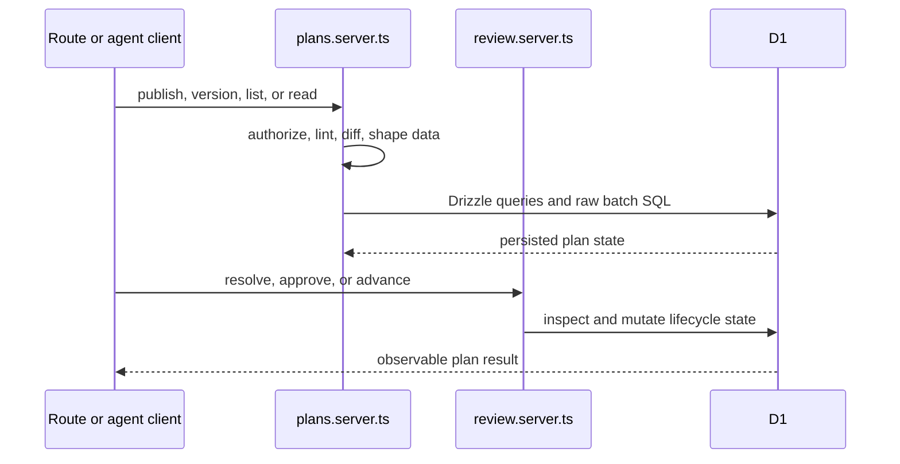
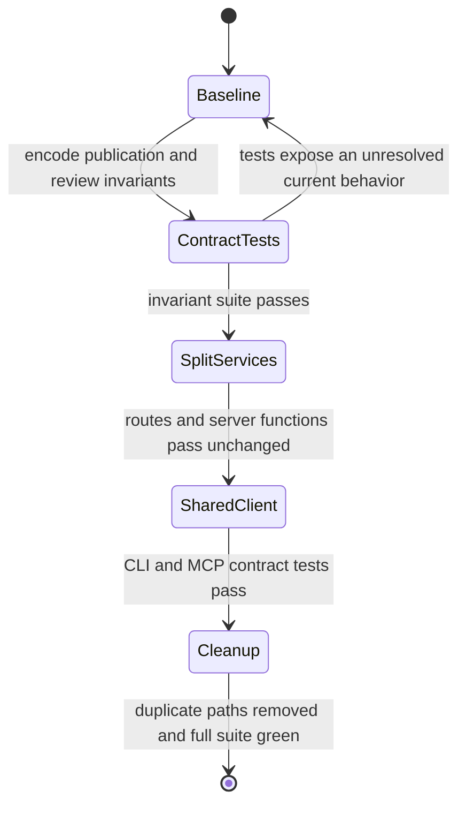

<TLDR id="plan-summary">
Keep the current architecture, split the oversized plan data service by cohesive operation, share the duplicated agent API client, and add database-backed contract tests for publication and review invariants. Cut over directly through existing callers, with each phase gated by observable behavior and a clean repository reference scan.
</TLDR>

## Evidence

The codebase is readable and strongly typed, but its highest-risk behavior is concentrated in a few growing modules with uneven focused test coverage.

### Verified facts

- `apps/web/src/lib/data/plans.server.ts:createPlan` and `createPlanVersion` combine authorization, validation, raw D1 transaction assembly, persistence, structural diffing, and response construction in a 485-line module.
- `apps/web/src/lib/data/review.server.ts:approvalGate` owns approval thresholds, open-decision blocking, lifecycle advancement, and version-bound approvals.
- `apps/web/src/routes/api/plans/index.ts:Route` and `apps/web/src/routes/p/$workspaceSlug/$planSlug/-data/plan-reader.ts:getPlanReaderData` are thin production callers that validate or shape data before delegating to server modules.
- `apps/cli/src/api.ts:PlantifilesClient` and `apps/mcp/src/api.ts:PlantifilesApi` independently implement authenticated requests, API errors, plan resolution, and overlapping response types.
- `packages/core/src/lint.test.ts`, `apps/web/src/routes/p/$workspaceSlug/$planSlug/-components/plan-render.test.tsx`, and `apps/web/e2e/plan-loop.spec.ts` defend core linting, rendered review behavior, and the full publish-review-approval loop.
- Repository measurement found 109 TypeScript source files and roughly 9,300 lines, with a 57-line median file, five files above 300 lines, and one `any` token.
- `pnpm test && pnpm lint` completed successfully before this plan was authored; 80 tests passed and all six workspace packages passed TypeScript and lint checks.

### Inferences

- **Inference:** publication and review rules can move behind narrower modules without changing HTTP, server-function, CLI, or MCP contracts. Validate this with database-backed contract tests before migrating callers.
- **Inference:** one shared API client can serve CLI and MCP without environment-specific branching. Validate the proposed client against both current request paths and error bodies in phase two.

<Diagram id="current-flow" lang="mermaid">

</Diagram>

## Design

Preserve the existing external contracts while making publication, reading, review policy, and agent API transport independently understandable and testable.

### Target seams

- `publish-plan.server.ts` owns source limits, lint gates, slugging, version creation, block and decision persistence, structural diffs, and publication responses.
- `plan-reader.server.ts` owns plan lookup, reader projections, Markdown rendering, list queries, and version history.
- `review.server.ts` remains the lifecycle authority; database-backed tests cross its exported functions and verify persisted outcomes.
- A shared agent API client owns transport, `ApiError`, response types, and plan URL resolution; CLI configuration and MCP tool registration remain in their apps.

### Invariants

- Existing HTTP status codes and JSON response shapes do not change.
- Every publication is authorized against workspace membership before mutation.
- A failed lint gate or failed batch leaves no partial plan, version, block, or decision rows.
- Approvals count only for the current immutable version; open current-version decisions block approval.
- Publishing over an approved plan returns it to `in_review`; archived remains terminal.
- CLI and MCP preserve their command and tool names, environment variables, authorization header, and error body behavior.

<Decision id="module-location" owner="@srujan">
Should the shared agent API client live in a new workspace package, or in `packages/core` with a dedicated export that keeps Markdown analysis dependencies out of agent bundles?
</Decision>

<Tradeoff id="client-location-options">
<Option name="Dedicated API client package" recommended>
A small `packages/api-client` workspace gives CLI and MCP one transport contract without coupling network code to Markdown analysis. It adds one explicit package boundary and build target.
</Option>
<Option name="Core API client export">
This avoids another workspace package, but it mixes remote transport with parsing and linting concerns and makes the core package less cohesive.
</Option>
</Tradeoff>

<Rejected id="rejected-repository-framework" what="Generic repository and service framework">
Interfaces for every table and operation would add ceremony without a second database implementation. Narrow modules and behavior-level tests address the observed risks with fewer concepts.
</Rejected>

<CodeSketch id="target-client" lang="ts" file="packages/api-client/src/index.ts">
```ts
export type PlantifilesClientConfig = {
  token: string;
  baseUrl: string;
};

export declare class PlantifilesClient {
  constructor(config: PlantifilesClientConfig);
  createPlan(input: PublishPlanInput): Promise<PublishedPlan>;
  createVersion(planId: string, input: PublishVersionInput): Promise<PublishedPlan>;
  resolvePlan(idOrUrl: string): Promise<PlanDetail>;
  listPlans(workspaceSlug: string, status?: string): Promise<PlanStatus[]>;
  commentOnPlan(planId: string, input: CommentInput): Promise<unknown>;
}
```
</CodeSketch>

## Delivery

Each phase keeps external contracts stable and uses named behavioral gates before obsolete code is removed.

<Diagram id="delivery-lifecycle" lang="mermaid">

</Diagram>

<Phase id="phase-contracts" n="1" title="Lock publication and review contracts">
- [ ] Add an isolated D1 test harness for `createPlan`, `createPlanVersion`, `approvalGate` behavior through exported review operations, and authorization failures
- [ ] Cover atomic publication, open-decision blocking, multi-approval thresholds, old-version approval rejection, approved-plan edits, owner-only transitions, and archived terminal state

**Gate:** The targeted database-backed suite passes from an empty test database and fails when each recorded invariant is deliberately violated.

**Rollback:** Remove only the new test harness and tests; production behavior and persisted data remain unchanged.
</Phase>

<Phase id="phase-services" n="2" title="Split publication and reader ownership">
- [ ] Move publication helpers and mutations from `plans.server.ts` to `publish-plan.server.ts` without changing their signatures or return shapes
- [ ] Move reader, list, Markdown, and history operations to `plan-reader.server.ts`, then migrate every API route and server-function import

**Gate:** Publication and review contract tests, web tests, and `pnpm --filter @plantifiles/web typecheck` pass; a reference scan finds no production import of the removed `plans.server.ts` exports.

**Rollback:** Restore the original module and imports; no schema or stored-data conversion is involved.
</Phase>

<Phase id="phase-client" n="3" title="Share the agent API client">
- [ ] Create the chosen client module with the union of CLI and MCP endpoints, precise response types, and current `ApiError` behavior
- [ ] Migrate `apps/cli` and `apps/mcp` while keeping command names, MCP tool schemas, environment variables, and URL resolution unchanged

**Gate:** CLI smoke scenarios, the MCP stdio contract test, and request-error contract tests pass against the same local service.

**Rollback:** Restore each app-local client; the server API and persisted data are unchanged.
</Phase>

<Phase id="phase-cleanup" n="4" title="Remove obsolete paths and verify">
- [ ] Delete the original combined service exports, duplicated API clients, stale types, and superseded tests
- [ ] Update package exports and repository guidance that names the changed module locations

**Gate:** `pnpm test`, `pnpm lint`, and the publish-review Playwright scenario pass; Knip reports no unused exports introduced by the cutover.

**Rollback:** Revert cleanup while the phase-two and phase-three compatibility evidence remains valid; otherwise return to the failed migration phase first.
</Phase>

<Risk id="risk-transaction-drift" severity="high">
Moving publication code can reorder raw D1 batch statements or diverge from the Drizzle schema. Preserve statement order, compare persisted rows in contract tests, and stop migration on any partial-write behavior.
</Risk>

<Risk id="risk-client-drift" severity="med">
The current CLI and MCP clients have already diverged in method names and response precision. Define the shared contract from both callsite sets and test errors as well as successful responses.
</Risk>

<Callout id="scope-boundary" kind="note">
Do not reorganize small, cohesive route or UI files during this work. The goal is to reduce risk at observed hotspots, not impose uniform file sizes.
</Callout>
