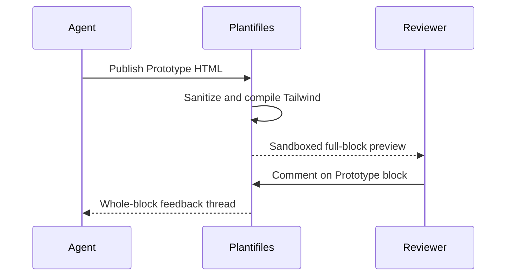
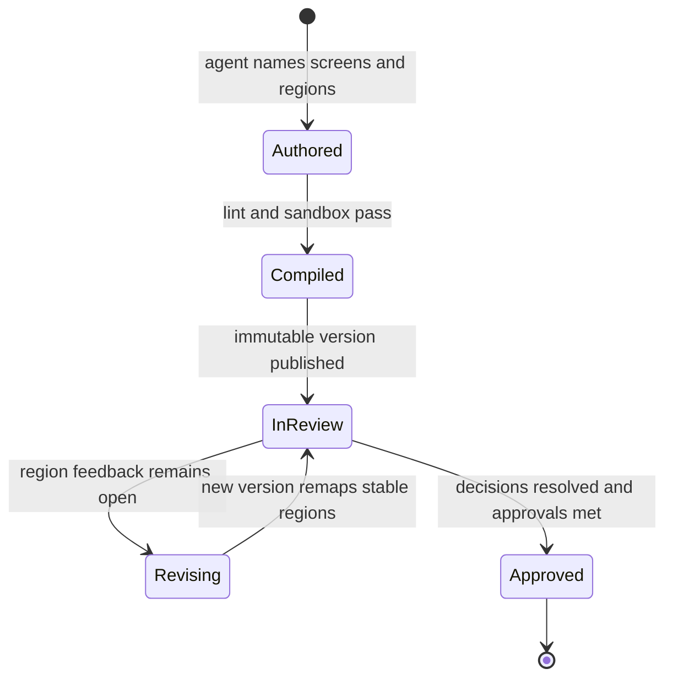

<TLDR id="plan-summary">
Turn static prototype blocks into a focused review studio with named screens, region-level feedback, and side-by-side flow context. Preserve the current sandboxed HTML renderer, immutable plan versions, and block review model while adding a declarative annotation layer that agents can author and teams can review without leaving Plantifiles.
</TLDR>

## Evidence

The current prototype module proves realistic plan-authored screens while keeping execution and review boundaries explicit.

### Verified facts

- `packages/core/src/lint.ts:286-301` validates one fenced HTML source, title, and viewport for every top-level `<Prototype>` block.
- `apps/web/src/routes/p/$workspaceSlug/$planSlug/-data/prototype-document.server.ts:sanitizeChildren,compilePrototypeDocument` sanitize HTML, compile static Tailwind candidates, and emit a restrictive CSP document.
- `apps/web/src/routes/p/$workspaceSlug/$planSlug/-components/plan-prototype.tsx:24-125` renders responsive, mobile, tablet, and desktop previews in sandboxed iframes.
- `apps/web/src/routes/p/$workspaceSlug/$planSlug/-components/plan-review-components.tsx:21-32` makes a prototype commentable only as one complete block today.
- `apps/web/src/routes/p/$workspaceSlug/$planSlug/-data/prototype-document.server.test.ts` covers generated Tailwind styles and removal of executable markup.

### Inferences

- **Inference:** Reviewers will ask for feedback on a specific control or state instead of the whole prototype. Validate with three moderated reviews before persisting region anchors.
- **Inference:** Agents can reliably author stable region names when the authoring skill provides a small `data-pf-region` convention. Validate against two generated plans before publication accepts region metadata.

<Diagram id="current-review-flow" lang="mermaid">

</Diagram>

## Product direction

The review studio keeps the plan readable while giving visual work the focused surface it needs.

<Decision id="region-identity" owner="@srujan">
Should region identity be authored explicitly with stable `data-pf-region` values, or derived from accessible labels when a prototype is compiled?
</Decision>

<Tradeoff id="region-options">
<Option name="Explicit stable regions" recommended>
Agents add a small declarative attribute to important controls and states. Review anchors survive layout changes and can be linted, but authors must choose meaningful identifiers.
</Option>
<Option name="Derived accessible regions">
Plantifiles creates anchors from labels and DOM position with no extra authoring syntax. Initial creation is effortless, but text edits and reordering can detach existing feedback.
</Option>
</Tradeoff>

<Rejected id="rejected-design-tool" what="External design-tool embeds">
Embedding a separate canvas preserves another product's interaction model but splits decisions, versions, permissions, and implementation evidence across systems. Plantifiles should own the review record and keep prototype source pullable by agents.
</Rejected>

### Desktop review studio

The desktop surface combines flow navigation, a generous product canvas, and decision context without turning the plan into a generic design tool.

<Prototype id="desktop-review-studio" title="Desktop prototype review studio" viewport="desktop">
```html
<div class="min-h-screen bg-stone-100 text-stone-950">
  <header class="flex h-16 items-center border-b border-stone-200 bg-white px-5 shadow-sm">
    <div class="flex items-center gap-3">
      <div class="flex size-9 items-center justify-center rounded-xl bg-orange-600 font-bold text-white shadow-sm">P</div>
      <div>
        <p class="text-sm font-bold tracking-tight">Plantifiles</p>
        <p class="text-[11px] text-stone-500">Product review workspace</p>
      </div>
    </div>
    <div class="mx-6 h-7 w-px bg-stone-200"></div>
    <div class="min-w-0 flex-1">
      <div class="flex items-center gap-2">
        <span class="rounded-full bg-amber-100 px-2 py-0.5 text-[10px] font-bold uppercase tracking-wide text-amber-800">In review</span>
        <span class="text-xs text-stone-400">v4</span>
      </div>
      <p class="mt-0.5 truncate text-sm font-semibold">Guided subscription upgrade</p>
    </div>
    <div class="flex items-center gap-2">
      <div class="flex -space-x-2">
        <div class="flex size-8 items-center justify-center rounded-full border-2 border-white bg-violet-200 text-[10px] font-bold text-violet-900">SG</div>
        <div class="flex size-8 items-center justify-center rounded-full border-2 border-white bg-sky-200 text-[10px] font-bold text-sky-900">MK</div>
        <div class="flex size-8 items-center justify-center rounded-full border-2 border-white bg-emerald-200 text-[10px] font-bold text-emerald-900">AL</div>
      </div>
      <button class="rounded-lg border border-stone-200 bg-white px-3 py-2 text-xs font-semibold shadow-sm">Share</button>
      <button class="rounded-lg bg-stone-950 px-3 py-2 text-xs font-semibold text-white shadow-sm">Approve version</button>
    </div>
  </header>

  <div class="grid h-[736px] grid-cols-[220px_minmax(0,1fr)_310px]">
    <aside class="border-r border-stone-200 bg-white p-4">
      <div class="flex items-center justify-between">
        <p class="text-[11px] font-bold uppercase tracking-[0.14em] text-stone-500">Prototype flow</p>
        <span class="rounded-md bg-stone-100 px-1.5 py-0.5 text-[10px] text-stone-500">4 screens</span>
      </div>
      <nav class="mt-4 space-y-1.5">
        <a href="#upgrade" class="flex items-center gap-3 rounded-xl border border-orange-200 bg-orange-50 p-2.5 shadow-sm">
          <div class="flex size-8 items-center justify-center rounded-lg bg-orange-600 text-xs font-bold text-white">01</div>
          <div class="min-w-0">
            <p class="truncate text-xs font-semibold">Upgrade overview</p>
            <p class="mt-0.5 text-[10px] text-orange-700">2 open comments</p>
          </div>
        </a>
        <a href="#plan" class="flex items-center gap-3 rounded-xl p-2.5 text-stone-600">
          <div class="flex size-8 items-center justify-center rounded-lg border border-stone-200 bg-stone-50 text-xs font-bold">02</div>
          <div class="min-w-0">
            <p class="truncate text-xs font-medium">Choose plan</p>
            <p class="mt-0.5 text-[10px] text-stone-400">Resolved</p>
          </div>
        </a>
        <a href="#payment" class="flex items-center gap-3 rounded-xl p-2.5 text-stone-600">
          <div class="flex size-8 items-center justify-center rounded-lg border border-stone-200 bg-stone-50 text-xs font-bold">03</div>
          <div class="min-w-0">
            <p class="truncate text-xs font-medium">Payment</p>
            <p class="mt-0.5 text-[10px] text-stone-400">1 decision</p>
          </div>
        </a>
        <a href="#success" class="flex items-center gap-3 rounded-xl p-2.5 text-stone-600">
          <div class="flex size-8 items-center justify-center rounded-lg border border-stone-200 bg-stone-50 text-xs font-bold">04</div>
          <div class="min-w-0">
            <p class="truncate text-xs font-medium">Confirmation</p>
            <p class="mt-0.5 text-[10px] text-stone-400">Ready</p>
          </div>
        </a>
      </nav>

      <div class="mt-7 border-t border-stone-200 pt-4">
        <p class="text-[11px] font-bold uppercase tracking-[0.14em] text-stone-500">Review progress</p>
        <div class="mt-3 h-1.5 overflow-hidden rounded-full bg-stone-100">
          <div class="h-full w-3/4 rounded-full bg-emerald-500"></div>
        </div>
        <div class="mt-2 flex justify-between text-[10px] text-stone-500">
          <span>6 resolved</span>
          <span>2 open</span>
        </div>
      </div>

      <div class="mt-5 rounded-xl bg-stone-950 p-3 text-white">
        <div class="flex items-center gap-2">
          <div class="flex size-7 items-center justify-center rounded-lg bg-white/10 text-xs">✦</div>
          <p class="text-xs font-semibold">Agent context</p>
        </div>
        <p class="mt-2 text-[10px] leading-4 text-stone-300">Source, decisions, and region comments will be returned with the plan.</p>
      </div>
    </aside>

    <main class="overflow-auto bg-[radial-gradient(circle_at_center,_#d6d3d1_1px,_transparent_1px)] bg-[length:20px_20px] p-8">
      <div class="mx-auto max-w-[760px]">
        <div class="mb-3 flex items-center justify-between">
          <div>
            <p class="text-sm font-semibold">Upgrade overview</p>
            <p class="text-[11px] text-stone-500">Desktop · 1440 × 900 · Signed-in member</p>
          </div>
          <div class="flex rounded-lg border border-stone-200 bg-white p-0.5 shadow-sm">
            <button class="rounded-md px-2.5 py-1.5 text-[10px] text-stone-500">Fit</button>
            <button class="rounded-md bg-stone-100 px-2.5 py-1.5 text-[10px] font-semibold">100%</button>
            <button class="rounded-md px-2.5 py-1.5 text-[10px] text-stone-500">Inspect</button>
          </div>
        </div>

        <section id="upgrade" class="relative overflow-hidden rounded-2xl border border-stone-300 bg-white shadow-2xl">
          <div class="flex h-12 items-center border-b border-slate-200 bg-slate-950 px-4 text-white">
            <div class="flex items-center gap-2">
              <div class="size-5 rounded-md bg-gradient-to-br from-violet-400 to-indigo-600"></div>
              <span class="text-xs font-bold">Orbit</span>
            </div>
            <nav class="ml-8 flex gap-5 text-[10px] text-slate-400">
              <span>Overview</span><span>Projects</span><span>Usage</span><span class="text-white">Billing</span>
            </nav>
            <div class="ml-auto flex items-center gap-2">
              <div class="size-6 rounded-full bg-slate-700"></div>
            </div>
          </div>

          <div class="grid grid-cols-[1fr_240px] gap-6 p-7">
            <div>
              <div class="flex items-start justify-between">
                <div>
                  <p class="text-[10px] font-bold uppercase tracking-[0.16em] text-violet-600">Orbit Pro</p>
                  <h1 class="mt-2 text-3xl font-bold tracking-tight text-slate-950">Build without the usage ceiling.</h1>
                  <p class="mt-3 max-w-md text-sm leading-6 text-slate-500">Unlock collaborative reviews, unlimited environments, and usage insights for your whole product team.</p>
                </div>
              </div>

              <div class="mt-7 grid grid-cols-3 gap-3">
                <div class="rounded-xl border border-slate-200 p-3">
                  <div class="flex size-8 items-center justify-center rounded-lg bg-violet-100 text-violet-700">✦</div>
                  <p class="mt-3 text-xs font-bold">Unlimited projects</p>
                  <p class="mt-1 text-[10px] leading-4 text-slate-500">No archive juggling as the team grows.</p>
                </div>
                <div data-pf-region="shared-review-benefit" class="relative rounded-xl border-2 border-violet-500 bg-violet-50/60 p-3">
                  <span class="absolute -top-2 right-2 rounded-full bg-violet-600 px-2 py-0.5 text-[8px] font-bold uppercase text-white">Most valued</span>
                  <div class="flex size-8 items-center justify-center rounded-lg bg-violet-600 text-white">◎</div>
                  <p class="mt-3 text-xs font-bold">Shared reviews</p>
                  <p class="mt-1 text-[10px] leading-4 text-slate-500">Decisions and approvals stay with the work.</p>
                </div>
                <div class="rounded-xl border border-slate-200 p-3">
                  <div class="flex size-8 items-center justify-center rounded-lg bg-sky-100 text-sky-700">↗</div>
                  <p class="mt-3 text-xs font-bold">Usage forecasts</p>
                  <p class="mt-1 text-[10px] leading-4 text-slate-500">Know the limit before your team hits it.</p>
                </div>
              </div>

              <div class="mt-6 flex items-center gap-3 rounded-xl bg-emerald-50 p-3 text-emerald-950">
                <div class="flex size-8 items-center justify-center rounded-full bg-emerald-100 text-sm">✓</div>
                <div>
                  <p class="text-xs font-semibold">Your current usage qualifies for a team credit</p>
                  <p class="text-[10px] text-emerald-700">$24 is applied automatically at checkout.</p>
                </div>
              </div>
            </div>

            <aside class="rounded-2xl bg-slate-950 p-5 text-white shadow-xl">
              <div class="flex items-center justify-between">
                <p class="text-xs font-semibold">Pro plan</p>
                <span class="rounded-full bg-white/10 px-2 py-1 text-[9px]">Save 20%</span>
              </div>
              <div class="mt-5 flex items-end gap-1">
                <span class="text-4xl font-bold tracking-tight">$32</span>
                <span class="mb-1 text-xs text-slate-400">/ member</span>
              </div>
              <p class="mt-1 text-[10px] text-slate-400">Billed annually · 4 members</p>

              <div class="my-5 h-px bg-white/10"></div>
              <div class="space-y-3 text-[11px]">
                <div class="flex justify-between"><span class="text-slate-400">Annual subtotal</span><span>$1,536</span></div>
                <div class="flex justify-between"><span class="text-slate-400">Team credit</span><span class="text-emerald-400">−$24</span></div>
                <div class="flex justify-between font-semibold"><span>Due today</span><span>$1,512</span></div>
              </div>

              <button data-pf-region="upgrade-primary-action" class="mt-5 w-full rounded-xl bg-violet-500 px-4 py-3 text-xs font-bold shadow-lg shadow-violet-950/40">Continue to plan</button>
              <button class="mt-2 w-full rounded-xl px-4 py-2 text-[10px] text-slate-400">Compare all plans</button>
              <div class="mt-4 flex items-center justify-center gap-1.5 text-[9px] text-slate-500">
                <span>●</span><span>Cancel any time within 14 days</span>
              </div>
            </aside>
          </div>

          <div class="absolute top-[294px] left-[356px] flex size-6 items-center justify-center rounded-full border-2 border-white bg-orange-600 text-[10px] font-bold text-white shadow-lg">1</div>
          <div class="absolute right-[22px] bottom-[88px] flex size-6 items-center justify-center rounded-full border-2 border-white bg-orange-600 text-[10px] font-bold text-white shadow-lg">2</div>
        </section>

        <div class="mt-4 flex items-center justify-center gap-2 text-[10px] text-stone-500">
          <span class="size-1.5 rounded-full bg-emerald-500"></span>
          <span>Sandboxed preview</span>
          <span>·</span>
          <span>2 named regions</span>
          <span>·</span>
          <span>Updated 4 minutes ago</span>
        </div>
      </div>
    </main>

    <aside class="overflow-auto border-l border-stone-200 bg-white">
      <div class="sticky top-0 z-10 flex h-12 items-center border-b border-stone-200 bg-white px-4">
        <button class="border-b-2 border-stone-950 px-2 py-3 text-xs font-semibold">Feedback <span class="ml-1 rounded-full bg-stone-100 px-1.5 py-0.5 text-[9px]">2</span></button>
        <button class="px-3 py-3 text-xs text-stone-400">Decisions</button>
        <button class="ml-auto text-stone-400">•••</button>
      </div>

      <div class="p-4">
        <div class="rounded-xl border border-orange-200 bg-orange-50 p-3">
          <div class="flex gap-2">
            <div class="flex size-6 shrink-0 items-center justify-center rounded-full bg-orange-600 text-[9px] font-bold text-white">1</div>
            <div>
              <p class="text-xs font-semibold">Shared reviews card</p>
              <p class="mt-1 text-[11px] leading-5 text-stone-600">Can we make the collaboration benefit concrete? “Unlimited reviewers” is easier to scan than the current description.</p>
            </div>
          </div>
          <div class="mt-3 flex items-center gap-2 border-t border-orange-200 pt-3">
            <div class="flex size-5 items-center justify-center rounded-full bg-violet-200 text-[8px] font-bold">MK</div>
            <span class="text-[10px] font-semibold">Mina</span>
            <span class="text-[9px] text-stone-400">12 min ago</span>
          </div>
          <div class="mt-3 rounded-lg border border-orange-200 bg-white px-3 py-2 text-[10px] text-stone-400">Reply to thread…</div>
        </div>

        <div class="mt-3 rounded-xl border border-stone-200 p-3">
          <div class="flex gap-2">
            <div class="flex size-6 shrink-0 items-center justify-center rounded-full bg-orange-600 text-[9px] font-bold text-white">2</div>
            <div>
              <p class="text-xs font-semibold">Continue action</p>
              <p class="mt-1 text-[11px] leading-5 text-stone-600">The total is annual but the price leads with monthly. Show the billing period in the button label before approval.</p>
            </div>
          </div>
          <div class="mt-3 flex items-center gap-2 border-t border-stone-100 pt-3">
            <div class="flex size-5 items-center justify-center rounded-full bg-sky-200 text-[8px] font-bold">AL</div>
            <span class="text-[10px] font-semibold">Andre</span>
            <span class="text-[9px] text-stone-400">4 min ago</span>
          </div>
          <div class="mt-3 flex gap-2">
            <button class="rounded-lg bg-stone-950 px-2.5 py-1.5 text-[9px] font-semibold text-white">Resolve</button>
            <button class="rounded-lg border border-stone-200 px-2.5 py-1.5 text-[9px] font-semibold">Reply</button>
          </div>
        </div>

        <div class="mt-5 border-t border-stone-200 pt-4">
          <div class="flex items-center justify-between">
            <p class="text-[11px] font-bold uppercase tracking-[0.14em] text-stone-500">Version activity</p>
            <button class="text-[10px] font-semibold text-orange-700">View diff</button>
          </div>
          <div class="mt-3 space-y-3">
            <div class="flex gap-2">
              <div class="mt-1 size-2 rounded-full bg-emerald-500"></div>
              <div><p class="text-[10px] font-semibold">Agent published v4</p><p class="text-[9px] text-stone-400">Updated price framing and credit callout</p></div>
            </div>
            <div class="flex gap-2">
              <div class="mt-1 size-2 rounded-full bg-stone-300"></div>
              <div><p class="text-[10px] font-semibold">Srujan approved v3</p><p class="text-[9px] text-stone-400">Previous approval cleared by v4</p></div>
            </div>
          </div>
        </div>
      </div>
    </aside>
  </div>
</div>
```
</Prototype>

### Mobile review handoff

The mobile surface prioritizes the selected region, its context, and one decisive response rather than shrinking the full desktop studio.

<Prototype id="mobile-review-handoff" title="Mobile region review" viewport="mobile">
```html
<div class="min-h-screen bg-stone-100 text-stone-950">
  <header class="sticky top-0 z-20 border-b border-stone-200 bg-white/95 px-4 pb-3 pt-4 shadow-sm">
    <div class="flex items-center justify-between">
      <button class="flex size-9 items-center justify-center rounded-full bg-stone-100 text-lg">‹</button>
      <div class="text-center">
        <p class="text-xs font-bold">Upgrade overview</p>
        <p class="mt-0.5 text-[10px] text-stone-500">v4 · Mobile review</p>
      </div>
      <button class="flex size-9 items-center justify-center rounded-full bg-stone-950 text-xs font-bold text-white">SG</button>
    </div>
    <div class="mt-3 flex items-center gap-2">
      <div class="h-1.5 flex-1 overflow-hidden rounded-full bg-stone-100"><div class="h-full w-3/4 rounded-full bg-emerald-500"></div></div>
      <span class="text-[10px] font-semibold text-stone-500">6/8</span>
    </div>
  </header>

  <main class="px-4 pb-32 pt-5">
    <div class="mb-3 flex items-center justify-between">
      <div>
        <p class="text-[10px] font-bold uppercase tracking-[0.14em] text-stone-500">Selected feedback</p>
        <p class="mt-1 text-sm font-semibold">Continue action</p>
      </div>
      <span class="rounded-full bg-orange-100 px-2.5 py-1 text-[10px] font-bold text-orange-800">Open</span>
    </div>

    <section class="relative overflow-hidden rounded-[28px] border-4 border-stone-900 bg-slate-950 shadow-2xl">
      <div class="flex h-6 items-center justify-center bg-stone-900"><div class="h-1 w-16 rounded-full bg-stone-700"></div></div>
      <div class="p-5 text-white">
        <div class="flex items-center justify-between">
          <div class="flex items-center gap-2"><div class="size-5 rounded-md bg-gradient-to-br from-violet-400 to-indigo-600"></div><span class="text-xs font-bold">Orbit</span></div>
          <div class="size-6 rounded-full bg-slate-700"></div>
        </div>
        <p class="mt-12 text-[10px] font-bold uppercase tracking-[0.16em] text-violet-400">Orbit Pro</p>
        <h1 class="mt-2 text-3xl font-bold leading-tight tracking-tight">Build without the usage ceiling.</h1>
        <p class="mt-3 text-xs leading-5 text-slate-400">Unlimited projects, shared reviews, and usage insights for the whole team.</p>

        <div class="mt-6 rounded-2xl bg-white p-4 text-slate-950">
          <div class="flex items-center justify-between">
            <p class="text-xs font-semibold">Pro plan</p>
            <span class="rounded-full bg-emerald-100 px-2 py-1 text-[9px] font-bold text-emerald-700">$24 credit</span>
          </div>
          <div class="mt-4 flex items-end gap-1"><span class="text-3xl font-bold">$32</span><span class="mb-1 text-[10px] text-slate-500">/ member</span></div>
          <p class="mt-1 text-[9px] text-slate-400">$1,512 billed annually for 4 members</p>
          <button data-pf-region="upgrade-primary-action" class="mt-5 w-full rounded-xl bg-violet-600 px-4 py-3 text-xs font-bold text-white shadow-lg">Continue to annual plan</button>
        </div>
      </div>
      <div class="absolute bottom-[31px] right-[16px] flex size-7 items-center justify-center rounded-full border-2 border-white bg-orange-600 text-[10px] font-bold text-white shadow-xl">2</div>
    </section>

    <section id="comment" class="relative -mt-6 rounded-3xl border border-stone-200 bg-white p-4 shadow-2xl">
      <div class="mx-auto mb-4 h-1 w-10 rounded-full bg-stone-200"></div>
      <div class="flex items-start gap-3">
        <div class="flex size-9 shrink-0 items-center justify-center rounded-full bg-sky-200 text-[10px] font-bold text-sky-900">AL</div>
        <div>
          <div class="flex items-center gap-2"><p class="text-xs font-bold">Andre Lee</p><span class="text-[9px] text-stone-400">4m</span></div>
          <p class="mt-1 text-xs leading-5 text-stone-600">The annual total is now clear. This button label resolves my concern and should be the approved copy.</p>
        </div>
      </div>
      <div class="mt-4 rounded-xl bg-stone-50 p-3">
        <p class="text-[9px] font-bold uppercase tracking-wide text-stone-400">Region</p>
        <p class="mt-1 text-[11px] font-semibold">upgrade-primary-action</p>
      </div>
      <div class="mt-4 grid grid-cols-2 gap-2">
        <button class="rounded-xl border border-stone-200 px-3 py-3 text-xs font-semibold">Reply</button>
        <button class="rounded-xl bg-stone-950 px-3 py-3 text-xs font-semibold text-white">Resolve thread</button>
      </div>
    </section>
  </main>

  <nav class="fixed bottom-0 left-0 right-0 border-t border-stone-200 bg-white/95 px-5 py-3 shadow-[0_-8px_30px_rgba(0,0,0,0.08)]">
    <div class="grid grid-cols-4 text-center text-[9px] text-stone-400">
      <div><div class="text-base">▦</div><span>Flow</span></div>
      <div class="font-bold text-orange-700"><div class="text-base">●</div><span>Feedback</span></div>
      <div><div class="text-base">◇</div><span>Decisions</span></div>
      <div><div class="text-base">✓</div><span>Approve</span></div>
    </div>
  </nav>
</div>
```
</Prototype>

<Callout id="prototype-note" kind="note">
These mockups deliberately resemble a finished surface, but every visual remains static plan source. Region pins and flow selection describe the intended contract; they do not imply executable JavaScript inside the sandbox.
</Callout>

<Diagram id="target-review-lifecycle" lang="mermaid">

</Diagram>

## Delivery

The implementation deepens the existing prototype module rather than creating a second artifact system.

<CodeSketch id="region-contract" lang="ts" file="packages/core/src/types.ts">
```ts
export type PrototypeRegion = {
  key: string;
  label: string;
  prototypeBlockKey: string;
};

export type PrototypeReviewTarget =
  | { kind: "prototype"; blockKey: string }
  | { kind: "region"; blockKey: string; regionKey: string };
```
</CodeSketch>

<Phase id="phase-region-contract" n="1" title="Prove stable region identity">
- [ ] Extend prototype analysis to collect unique `data-pf-region` values from sanitized HTML
- [ ] Reject duplicate or malformed region keys without weakening existing HTML and CSP checks
- [ ] Add contract tests covering insertion, movement, deletion, and malicious attributes

**Gate:** Focused core and compiler tests prove stable region keys, duplicate rejection, and unchanged executable-markup removal.

**Rollback:** Keep whole-block prototype comments as the only target; no persisted review data changes in this phase.
</Phase>

<Phase id="phase-review-studio" n="2" title="Render the focused review studio">
- [ ] Add screen navigation, selected-region overlays, and desktop/mobile review layouts behind the current plan route
- [ ] Migrate prototype comment creation to the typed review target while preserving whole-block threads
- [ ] Exercise keyboard focus, small screens, version switching, and detached-region feedback

**Gate:** A browser scenario publishes two screens, creates region feedback, revises surrounding layout, and observes the thread on the same named region.

**Rollback:** Disable region selection and continue rendering the existing responsive prototype frame with whole-block threads.
</Phase>

<Phase id="phase-agent-loop" n="3" title="Close the agent revision loop">
- [ ] Return region labels and unresolved feedback through plan detail and MCP responses
- [ ] Update the write-plan skill with stable region naming and screen-flow examples
- [ ] Remove temporary untyped target handling after CLI, MCP, and web callers use the shared contract

**Gate:** A separate agent pulls the reviewed plan, identifies the exact region feedback, publishes a revision, and the browser shows the thread retained on the new version.

**Rollback:** Return whole-block comments only and preserve stored region targets until the agent contract is corrected.
</Phase>

<Risk id="risk-false-fidelity" severity="high">
High-fidelity mockups can imply completed accessibility, interaction, and backend behavior. The reader must label prototypes as sandboxed previews, keep behavioral requirements in prose and phases, and require implementation gates separate from visual approval.
</Risk>

<Risk id="risk-anchor-drift" severity="med">
Region feedback can detach when an agent renames or removes a target. Explicit stable keys, version-aware detached-thread presentation, and a lint warning for removed commented regions keep that failure visible instead of silently reassociating feedback.
</Risk>
