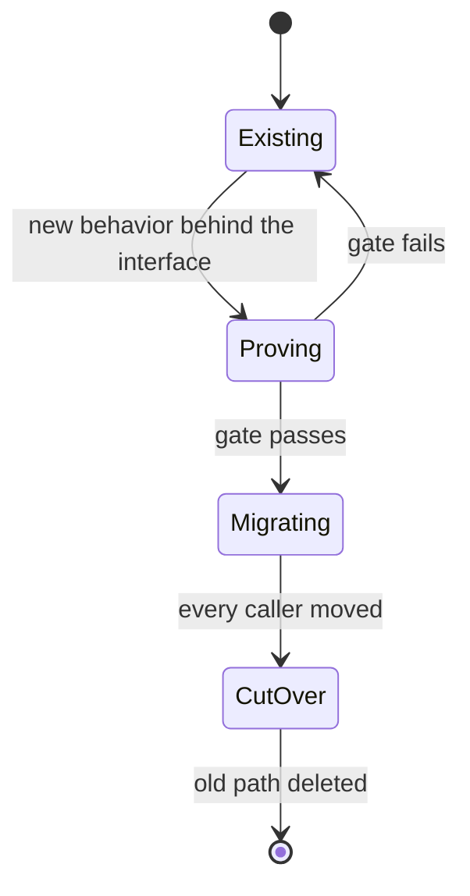

# Write a Plantifile

Produce one source that a person understands and an agent acts on.

This skill gets downloaded into other repositories, so every rule it needs lives in this file.

## 1. Pick the document type

Choose the kind that matches what the reader must walk away with:

- `plan` decides and delivers a change.
- `lesson` builds understanding of one topic.
- `guided-plan` teaches enough to judge a change, then delivers it.

Every document carries `title`, `kind`, and `emoji`. A `lesson` or `guided-plan` adds two more:

- a one-line `audience` stating what readers already know;
- one to five `outcomes`, each naming something the reader can explain, predict, compare, trace, review, or do.

**Done when:** you can name the type and say why it fits the reader's job.

## 2. Gather evidence

Plans and guided plans rest on the repository itself. Read the request or issue, the repo instructions, the code that owns the behavior, every production caller, and the tests covering success, failure, and regression. Include public types, configuration, migrations, commands, and user docs anywhere the change touches them.

A lesson needs trustworthy sources for facts the repository cannot prove. Find them before writing.

Run a real experiment only when source and tests both fail to answer a runtime question, then record the command and its result.

Sort claims into two sections. Proven claims go under `### Verified facts`, each citing a repository path plus a symbol or line range, and test names for behavior. Guesses go under `### Inferences`, each starting with **Inference:** and naming how it will be tested.

**Done when:** every important claim cites evidence or openly labels itself an inference.

## 3. Build the plan and learning path

### For `plan`

Name the interface that owns the change, every caller that moves, and every old path that dies. State the rules callers depend on: input, output, ordering, failure, persistence, authorization, performance. Record the real decisions, tradeoffs, risks, delivery gates, and rollback path.

### For `lesson`

Teach the smallest mental model that makes the outcomes reachable:

1. Show why the idea matters.
2. Explain it with a diagram, code example, table, or trace taken from reality.
3. Ask the reader to remember or predict something.
4. Reveal the answer and the reason behind it.
5. Ask the reader to apply or explain the idea themselves.
6. Close with a recap and a next action.

### For `guided-plan`

Do both jobs in one document. Teaching sits beside the decision, risk, diagram, or phase that needs it. Skip the textbook appendix at the end.

**Done when:** the reader can say what changes, why it works, how to prove it, and what they now understand.

## 4. Write reversible phases

Each `<Phase>` carries three things: tasks, an observable **Gate**, and a concrete **Rollback**.

A good gate points at a test, command, measured rule, count, or visible result. "Code complete" proves nothing.

Sequence matters: prove the new path first, move callers next, delete old code last.

Include two diagrams that do different jobs. One might show request order, another ownership, state, failure, or cutover. Leave out anything decorative.

**Done when:** every phase can be proved and rolled back without guessing.

## 5. Add real questions

Quizzes use `<Check>` blocks in four kinds:

- `predict`: answer before seeing what happens.
- `recall`: bring back a fact or relationship.
- `apply`: use the idea on a fresh case.
- `reflect`: explain a decision or uncertainty in your own words.

Every `lesson` and `guided-plan` includes at least one memory question (a `predict` or `recall`) and at least one transfer question (an `apply` or `reflect`).

Each Check declares a unique `id`, a `kind`, and a plain-text `prompt` of 40 words or fewer, followed by `**Answer:**` and `**Why:**`, then optionally `**Next:**` and optionally `for="BLOCK_ID"` pointing at another root component in the same document.

Ask something that takes thought. A question whose answer was stated one sentence earlier tests nothing.

**Done when:** questions cover both memory and transfer, and every answer explains why.

## 6. Lint, publish, and pull back

Copy the template below and fill in every uppercase placeholder.

Lint first:

```sh
plantifiles lint <file>
```

Read the output rather than trusting the exit code. Fix every error and warning, because a zero exit code can still hide warnings.

Publish:

```sh
plantifiles push <file> --workspace <slug> --emoji <emoji> --agent <agent-name> --prompt "<original request>"
```

Unsure which workspace to target? List them:

```sh
plantifiles workspaces
```

Once published, pull the page back and confirm the document survived the round trip:

```sh
plantifiles pull <url> -o /tmp/published-plantifile.mdx
```

**Done when:** lint reports `errors 0 warnings 0`, push returns a URL, the page opens, and the pulled Markdown contains the full document.

## Document rules

- Put exactly one `<TLDR>` right after the frontmatter, 60 words or fewer.
- Open every `##` section with one physical line of summary text, 30 words or fewer.
- Hold paragraphs to 120 words and five sentences.
- Stop headings at `###`.
- Keep reading time at 12 minutes or less. Plantifiles counts 200 words per minute.
- Keep all prompts, answers, evidence, diagrams, code, gates, and rollback in source, not only in conversation.
- Use Markdown alone. Raw HTML and executable MDX break rendering.
- Put component content between opening and closing tags.
- Stick to the components below. Unknown components, props, and values are errors.

Plans and guided plans also:

- include Decision, Phase, and Diagram blocks;
- reject one alternative explicitly with a Rejected block;
- ship two diagrams of different types, each doing a distinct job;
- name an owner on every Decision;
- give every Phase tasks, a Gate, and a Rollback;
- give every Tradeoff at least two Options with exactly one marked `recommended`;
- rate every Risk `low`, `med`, or `high`.

Lessons and guided plans also:

- state audience and outcomes;
- include one retrieval Check and one transfer Check;
- warn on paragraphs above 60 words;
- end by revisiting outcomes, naming unresolved uncertainty, and giving a next action.

Scoring starts at 100 points, loses 10 per error and 3 per warning, and never falls below 0. Publication requires zero errors and a score of 70 or higher. This skill holds itself to zero errors and zero warnings.

## Placement and IDs

These components sit at the document root: `TLDR`, `Decision`, `Tradeoff`, `Rejected`, `Phase`, `Risk`, `Diagram`, `CodeSketch`, `Callout`, and `Check`.

`Option` nests exactly one level deep, always as a direct child of `Tradeoff`.

Every top-level component may take an `id`; Check requires one. An id is unique, starts with an ASCII letter, and contains only ASCII letters, digits, `_`, or `-`. Once assigned, an id sticks: move or rewrite a block and its id stays put, so Checks and links keep pointing at it.

## Component reference

| Component | Required props | Put inside |
|---|---|---|
| `<TLDR>` | none | Result summary, at most 60 words |
| `<Decision>` | `owner` | One real unanswered question |
| `<Tradeoff>` | none | At least two direct Options |
| `<Option>` | `name`; exactly one sibling has `recommended` | Pros and cons |
| `<Rejected>` | `what` | Why the option lost |
| `<Phase>` | `n`, `title` | Tasks, Gate, and Rollback |
| `<Risk>` | `severity="low|med|high"` | Risk and mitigation |
| `<Diagram>` | `lang="mermaid|d2"` | One matching fenced diagram |
| `<CodeSketch>` | `lang`; optional `file` | One fenced code block |
| `<Callout>` | `kind="note|warning"` | Supporting context |
| `<Check>` | `id`, `kind`, `prompt`; optional `for` | Answer, Why, and optional Next |

Pick the diagram type that matches the truth being shown:

- `sequenceDiagram` for requests, actors, ordering, and failure;
- `stateDiagram-v2` for lifecycle and cutover;
- `flowchart` or `graph` for data and control flow;
- `erDiagram` for stored relationships.

Reach for `<CodeSketch>` only when a small type, payload, row, or function signature genuinely clarifies a rule.

## Guided-plan template

Trim the template to fit. A `plan` drops audience, outcomes, and Checks whenever they add no value. A `lesson` drops Decision, Phase, and other planning blocks that teach nothing.

`````mdx
---
title: DOCUMENT TITLE
kind: guided-plan
emoji: 🧭
audience: READERS AND WHAT THEY ALREADY KNOW
outcomes:
  - Explain FIRST OBSERVABLE OUTCOME
  - Apply SECOND OBSERVABLE OUTCOME
---
<TLDR id="summary">
State what changes, what the reader will learn, and how success will be proved.
</TLDR>

## Evidence

Show what is true today and what still needs testing.

### Verified facts

- `PATH:SYMBOL` proves FACT FROM CODE.
- `CALLER_PATH:SYMBOL` shows HOW THIS CALLER USES THE INTERFACE.
- `TEST_PATH:TEST NAME` pins BEHAVIOR THIS TEST PROTECTS.

### Inferences

- **Inference:** ASSUMPTION. Prove it with TEST, COMMAND, OR OWNER DECISION before PHASE GATE.

<Check id="predict-current-failure" kind="predict" prompt="What breaks if only one side of the interface changes?">
**Answer:** EXPECTED FAILURE.

**Why:** MECHANISM THAT CAUSES THE FAILURE.

**Next:** WHAT TO INSPECT OR TRY.
</Check>

<Diagram id="current-flow" lang="mermaid">
```mermaid
sequenceDiagram
  Actor->>CurrentModule: current request
  CurrentModule->>Dependency: current operation
  Dependency-->>CurrentModule: result or failure
  CurrentModule-->>Actor: visible response
```
</Diagram>

## Design

Put the behavior behind one interface and state the rules callers can trust.

<Decision id="open-decision" owner="@OWNER">
What real question must OWNER answer before cutover?
</Decision>

<Tradeoff id="design-options">
<Option name="PREFERRED OPTION" recommended>
Why this option wins and what it costs.
</Option>
<Option name="OTHER VIABLE OPTION">
Why this option could work and what it costs.
</Option>
</Tradeoff>

<Rejected id="rejected-option" what="REJECTED OPTION">
Why this option lost.
</Rejected>

<CodeSketch id="target-interface" lang="ts" file="TARGET_PATH">
```ts
export type Input = { id: string };
export type Result = { id: string; status: "accepted" | "rejected" };

export declare function execute(input: Input): Promise<Result>;
```
</CodeSketch>

<Check id="recall-interface-rule" kind="recall" for="target-interface" prompt="Which rule must every caller be able to trust?">
**Answer:** THE IMPORTANT INTERFACE RULE.

**Why:** WHY BREAKING IT HURTS CALLERS.
</Check>

## Delivery

Prove the new path, move every caller, then delete the old path.

<Diagram id="cutover-lifecycle" lang="mermaid">

</Diagram>

<Phase id="phase-prove" n="1" title="Prove the interface">
- [ ] Add the new behavior behind INTERFACE
- [ ] Exercise success and failure with NAMED TESTS

**Gate:** COMMAND OR TEST produces EXPECTED RESULT.

**Rollback:** Restore LAST WORKING INTERNAL BUILD.
</Phase>

<Phase id="phase-migrate" n="2" title="Move every caller">
- [ ] Move NAMED PRODUCTION CALLERS
- [ ] Observe METRIC, COMPARISON, OR COUNT

**Gate:** OBSERVATION proves every caller uses the new path.

**Rollback:** Restore old routing before accepting new work.
</Phase>

<Phase id="phase-cleanup" n="3" title="Delete the old path">
- [ ] Delete old code, adapters, flags, configuration, and dead tests
- [ ] Update public types and user docs

**Gate:** Repository references find no caller of the old interface, and NAMED TESTS pass.

**Rollback:** Revert cleanup only while cutover evidence remains valid.
</Phase>

<Check id="apply-new-case" kind="apply" for="phase-prove" prompt="How would you prove the same interface under a different failure?">
**Answer:** EXPECTED TEST OR OBSERVATION.

**Why:** WHY THAT RESULT PROVES THE RULE.

**Next:** NEXT REAL ACTION.
</Check>

<Risk id="main-risk" severity="high">
Name the most likely serious failure and its concrete mitigation.
</Risk>

<Callout id="rollback-rule" kind="warning">
Keep rollback until cutover passes. Delete it with the old path instead of keeping two permanent interfaces.
</Callout>

## Recap

Restate what the reader can now explain and do.

- **Outcomes revisited:** FIRST OUTCOME and SECOND OUTCOME.
- **Unresolved uncertainty:** OPEN DECISION OR REMAINING GAP.
- **Next real action:** FIRST DELIVERY STEP.
`````