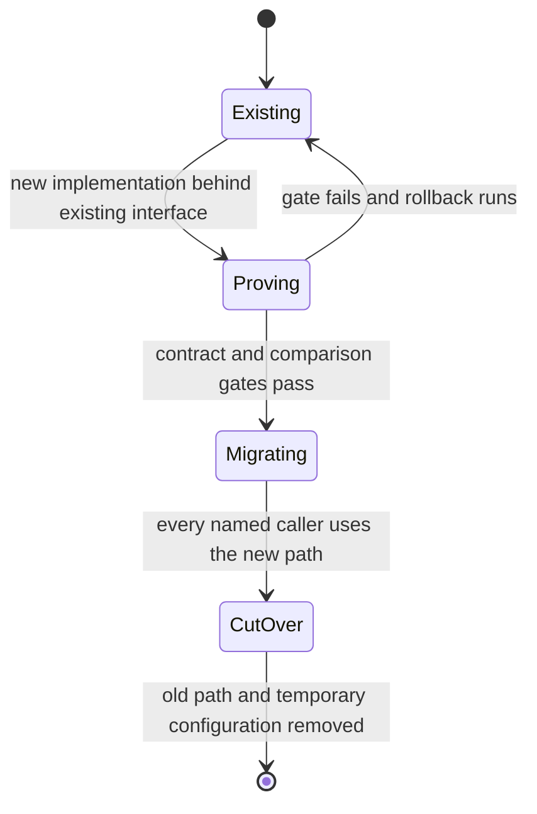

# Write a Plantifiles plan

Produce an evidence-backed implementation plan whose decisions, invariants, phases, and cutover gates remain useful during implementation.

This downloadable skill is self-contained. It cannot rely on Plantifiles repository-local instructions or references; everything required to author a valid plan is in this file.

## Workflow

### 1. Establish authority before proposing a design

Read the target repository's agent instructions and the originating request, issue, specification, or decision record. Extract the requested behavior, acceptance criteria, compatibility constraints, and named non-goals.

Then inspect the repository itself:

- Read the current implementation at the proposed change point and identify the symbols that own the behavior.
- Find every production callsite of the affected interface, including jobs, routes, scripts, and adapters.
- Read tests that exercise the current observable contract, failure paths, and prior regressions.
- Inspect public types, configuration, migrations, commands, and user-facing documentation when the change can affect them.
- Run a narrow experiment only when source and tests cannot establish a runtime fact; record the command and observed result.

Do not design until every acceptance criterion is tied to current code, a test, an observed command result, or an explicitly labeled gap.

### 2. Separate evidence from inference

Record the research in the plan itself; do not depend on a supplemental file. Use repository-relative paths plus symbols or line ranges for source evidence, test names for behavioral evidence, and commands plus observed output for experiments.

Under `### Verified facts`, state only facts established by that evidence. Under `### Inferences`, label each assumption and say how implementation will validate or resolve it. A design claim is ready only when it is verified or carries an explicit validation gate.

### 3. Choose a deep seam and state invariants

A **module** is an interface plus its implementation. A **seam** is the location of that interface. Prefer a deep module: callers learn a small interface while validation, ordering, errors, state transitions, and integration details stay behind it. Callers and contract tests should cross the same seam.

Choose the seam from the callsite and ownership evidence, not from a hypothetical abstraction. Introduce an adapter seam only where behavior genuinely varies. Name the production callers that will migrate to the preferred interface and the obsolete paths that cutover will remove.

Write explicit invariants for identity, input validity, output shape, ordering, failure behavior, persistence, authorization, and performance wherever they constrain the change. Use a `<Decision>` only for a real unresolved question, and set `owner` to the person or team accountable for resolving it. Compare viable choices in `<Tradeoff>`, then record at least one considered alternative in a top-level `<Rejected>` with the concrete reason it lost.

### 4. Design observable, reversible phases

Each `<Phase>` must identify the affected implementation and callsites, an observable completion gate, and a rollback action. Prefer gates such as a named contract test, a reproducible command and expected result, a measured invariant, or a verified migration count. “Code complete” is not an observable gate.

Sequence phases so the new path is proven behind the chosen interface, production callers are migrated, the cutover is observed, and obsolete code, configuration, and compatibility paths are removed. Keep rollback available until the cutover gate passes; state what restores the last known-good behavior and what data handling rollback requires.

Draw the current behavior and the proposed transition or lifecycle. A diagram must reveal ordering, ownership, state, or failure behavior that prose alone does not make obvious.

### 5. Author and lint

Copy the template, replace every uppercase placeholder, choose one representative emoji, and keep the component names and prop shapes exact.

Run:

```sh
plantifiles lint <file>
```

Fix every reported error and warning, then repeat until there are no findings. The CLI exits nonzero only when errors exist, so a zero exit does not prove warnings are absent; inspect the findings and score. Scoring starts at 100, subtracts 10 per error and 3 per warning, and floors at 0. The runtime publication gate is exactly `errors === 0 && score >= 70`, so a warning-only document may publish when its score is at least 70. This workflow intentionally requires zero findings.

### 6. Publish with provenance

On the first push, `--workspace` is required. Publish the linted source with the same emoji and the originating prompt:

```sh
plantifiles push <file> --workspace <slug> --emoji <emoji> --agent <agent-name> --prompt "<request or planning prompt>"
```

Done means the command returns a URL, that URL opens the published plan, and the published version records the intended source, emoji, agent, and prompt.

## Grammar and lint contract

All maxima are inclusive:

- Put exactly one `<TLDR>` first after frontmatter; it may contain at most 60 words.
- Begin every `##` section with a one-line summary paragraph of at most 30 words.
- Keep every paragraph to at most 120 words and at most 5 sentences.
- Include at least one `<Decision>`, `<Phase>`, and `<Diagram>`.
- Include at least two `<Diagram>` blocks with varied diagram types to avoid the diagram-count warning.
- Give every `<Decision>` a nonempty `owner` naming its actual decision owner.
- Give every `<Tradeoff>` at least two direct `<Option>` children and mark exactly one of them `recommended`.
- Give every `<Risk>` a severity of `low`, `med`, or `high`.
- Use headings no deeper than `###`.
- Keep estimated read time at or below 12 minutes; the linter estimates 200 words per minute.
- Include a top-level `<Rejected>` naming an alternative and explaining why it lost.
- Put every block component's children on lines between its opening and closing tags.
- Use Markdown prose, not raw HTML or executable MDX.

Placement is strict. Place `<TLDR>`, `<Decision>`, `<Tradeoff>`, `<Rejected>`, `<Phase>`, `<Risk>`, `<Diagram>`, `<CodeSketch>`, and `<Callout>` directly at the document root. The sole component nesting relationship is `<Option>` as a direct child of `<Tradeoff>`; `<Option>` is invalid anywhere else.

Every top-level component may have an optional explicit `id`. Use IDs for blocks whose identity must survive content edits or movement so structural diffs remain deterministic. An ID must be unique across the document and match `^[A-Za-z][A-Za-z0-9_-]*$`: an ASCII letter first, followed only by ASCII letters, digits, `_`, or `-`. Keep an established ID unchanged when editing or moving its block.

## Component vocabulary

Use only these custom components and prop shapes:

| Component | Required props | Content |
|---|---|---|
| `<TLDR>` | — | Prose, at most 60 words |
| `<Decision>` | `owner` | One unresolved question |
| `<Tradeoff>` | — | At least two direct `<Option>` children |
| `<Option>` | `name`; exactly one sibling has `recommended` | Pros and cons |
| `<Rejected>` | `what` | Why the alternative lost |
| `<Phase>` | `n`, `title` | Prose and a task checklist, including gate and rollback |
| `<Risk>` | `severity="low|med|high"` | Risk and mitigation |
| `<Diagram>` | `lang="mermaid|d2"` | Exactly one fenced diagram source block |
| `<CodeSketch>` | `lang`; optional `file` | Exactly one fenced code block |
| `<Callout>` | `kind="note|warning"` | Supporting context |

An optional `id` follows the identity rule above. A `<Diagram>` fence should match its `lang`. Use `flowchart` or `graph` for data and control flow, `sequenceDiagram` for cross-actor ordering and failures, `stateDiagram-v2` for lifecycles, and `erDiagram` for stored relationships. Use `<CodeSketch>` only when a minimal type, payload, table row, or function signature makes an interface invariant precise.

## Complete template

Replace every uppercase placeholder with repository evidence and project-specific decisions. Keep the root placement and direct `<Option>` nesting unchanged.

`````mdx
---
title: PLAN TITLE
emoji: 🧭
---
<TLDR id="plan-summary">
Summarize the intended outcome, chosen seam, proof strategy, and cutover in no more than sixty words.
</TLDR>

## Evidence

The plan separates verified repository behavior from assumptions that still require validation.

### Verified facts

- `PATH:SYMBOL` — `FACT ESTABLISHED BY SOURCE OR TEST`.
- `CALLSITE_PATH:SYMBOL` — `HOW THIS PRODUCTION CALLER USES THE CURRENT INTERFACE`.
- `TEST_PATH:TEST_NAME` — `OBSERVABLE CONTRACT OR FAILURE PATH THE TEST DEFENDS`.

### Inferences

- **Inference:** `ASSUMPTION`. Validate it with `COMMAND, TEST, OR OWNER DECISION` before `PHASE GATE`.

<Diagram id="current-flow" lang="mermaid">
```mermaid
sequenceDiagram
Actor->>CurrentModule: current request
CurrentModule->>Dependency: current operation
Dependency-->>CurrentModule: current result or failure
CurrentModule-->>Actor: observable response
```
</Diagram>

## Design

The design concentrates behavior behind one evidence-backed interface and makes its invariants observable to callers and tests.

<Decision id="cutover-decision" owner="@OWNER">
Should `NAMED CALLERS` cut over after `OBSERVABLE GATE`, or does evidence require a bounded dual-run period?
</Decision>

<Tradeoff id="cutover-options">
<Option name="Direct cutover">
This removes the old path sooner, but it is viable only when contract tests prove every named caller and failure path.
</Option>
<Option name="Bounded dual run" recommended>
This compares behavior before cutover while keeping one interface, with an explicit end condition for deleting the temporary path.
</Option>
</Tradeoff>

<Rejected id="rejected-compatibility-layer" what="Permanent compatibility layer">
It preserves two interfaces indefinitely, disperses invariants across callers, and makes every later change repay the migration cost.
</Rejected>

<CodeSketch id="target-interface" lang="ts" file="TARGET_PATH">
```ts
export type Input = { id: string; payload: unknown };
export type Result = { id: string; status: "accepted" | "rejected" };

export declare function execute(input: Input): Promise<Result>;
```
</CodeSketch>

## Delivery

Each phase names its observable gate and rollback before the next phase can begin.

<Diagram id="cutover-lifecycle" lang="mermaid">

</Diagram>

<Phase id="phase-prove" n="1" title="Prove the interface">
- [ ] Implement the new behavior behind `INTERFACE` without changing caller-visible invariants
- [ ] Exercise `NAMED CONTRACT TESTS OR REPRODUCTION` across success and failure paths

**Gate:** `COMMAND OR SCENARIO` produces `EXPECTED OBSERVATION` for every recorded invariant.

**Rollback:** Route the interface to `LAST KNOWN-GOOD IMPLEMENTATION`; no persistent data has changed incompatibly.
</Phase>

<Phase id="phase-migrate" n="2" title="Migrate and cut over">
- [ ] Migrate `EVERY NAMED PRODUCTION CALLER` to the preferred interface
- [ ] Observe `METRIC, COMPARISON, OR MIGRATION COUNT` before declaring cutover

**Gate:** `CUTOVER OBSERVATION` proves all callers use the new path and meet the invariant bounds.

**Rollback:** Restore the previous routing and run `DATA RECONCILIATION ACTION` before accepting new work.
</Phase>

<Phase id="phase-cleanup" n="3" title="Remove the obsolete path">
- [ ] Delete the old implementation, temporary adapter, configuration, and dead tests
- [ ] Update public types and documentation that named the removed path

**Gate:** Repository reference search finds no production caller of the obsolete interface, and the named contract suite remains green.

**Rollback:** Revert this cleanup only while the retained cutover evidence remains valid; otherwise return to the migration phase.
</Phase>

<Risk id="risk-output-drift" severity="high">
The two implementations may diverge silently. Compare canonical outputs at the proving gate and stop cutover on any unexplained mismatch.
</Risk>

<Callout id="rollback-window" kind="warning">
Keep rollback available until the cutover observation passes; remove it with the obsolete path rather than preserving a permanent second interface.
</Callout>
`````
