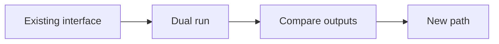

# Write a Plantifiles plan

Produce a reviewable plan whose decisions, alternatives, risks, and phases can survive into implementation.

## Workflow

1. Draft MDX from the template below. Replace every placeholder and keep the component names and prop shapes exact.
2. Name the real decision owner. Record at least one rejected alternative and the reason it lost.
3. Run `plantifiles lint <file>` and fix every finding. Repeat until the command exits successfully with score 90 or higher.
4. Publish with provenance: `plantifiles push <file> --workspace <slug> --agent <agent-name> --prompt "<feature request or planning prompt>"`.

Done means the published URL opens, lint is at least 90, and the version records both the agent and prompt.

## Lint targets

- Open with exactly one `<TLDR>` as the first block after frontmatter; keep it under 60 words.
- Begin every `##` section with a one-line summary paragraph under 30 words.
- Keep each paragraph within 5 sentences and 120 words.
- Include at least one `<Decision>`, `<Phase>`, and `<Diagram>`.
- Give every `<Decision>` an `owner`.
- Put at least two `<Option>` blocks in each `<Tradeoff>` and mark exactly one `recommended`.
- Set every `<Risk>` severity to `low`, `med`, or `high`.
- Use headings through `###` only.
- Use only the components in this skill and write prose as Markdown rather than raw HTML.
- Put block-component children on lines between the opening and closing tags.
- Include a `<Rejected>` block naming an alternative and why it lost.
- Keep estimated read time at or below 12 minutes.

## Component vocabulary

| Component | Required props | Content |
|---|---|---|
| `<TLDR>` | — | Prose, at most 60 words |
| `<Decision>` | `owner`; optional `id` | The unresolved question |
| `<Tradeoff>` | — | At least two `<Option>` blocks |
| `<Option>` | `name`; exactly one sibling has `recommended` | Pros and cons |
| `<Rejected>` | `what` | Why the alternative lost |
| `<Phase>` | `n`, `title` | Prose and a task checklist |
| `<Risk>` | `severity="low|med|high"` | Risk and mitigation |
| `<Diagram>` | `lang="mermaid|d2"` | One fenced diagram source block |
| `<CodeSketch>` | `lang`; optional `file` | One fenced code block |
| `<Callout>` | `kind="note|warning"` | Supporting context |

## Complete template

`````mdx
---
title: Replace with the plan title
---
<TLDR>
Ship the change in small, reversible phases while preserving the current contract until the new path is proven.
</TLDR>

## Context

The current path is costly to change and has no single owner.

<Decision owner="@owner" id="cutover-strategy">
Should the team cut over in one release or run both paths until production evidence is sufficient?
</Decision>

<Tradeoff>
<Option name="Single cutover">
Less temporary code, but one release carries all migration risk.
</Option>
<Option name="Measured dual run" recommended>
More temporary work, but production comparison makes rollback and correctness visible.
</Option>
</Tradeoff>

<Rejected what="Permanent compatibility layer">
It keeps two contracts alive indefinitely and makes every future change pay the migration cost again.
</Rejected>

## Delivery

The implementation proves the new path before removing the old one.

<Phase n="1" title="Prove the path">
- [ ] Add the new path behind the existing interface
- [ ] Compare outputs on representative production-shaped inputs
</Phase>

<Phase n="2" title="Cut over">
- [ ] Route production traffic to the proven path
- [ ] Remove the old path and its configuration
</Phase>

<Risk severity="high">
A silent output mismatch could corrupt downstream state. Compare canonical outputs before changing traffic.
</Risk>

<Diagram lang="mermaid">

</Diagram>

<CodeSketch lang="ts" file="src/new-path.ts">
```ts
export function execute(input: Input): Output {
  return transform(input)
}
```
</CodeSketch>

<Callout kind="warning">
Keep rollback available until the comparison gate passes on production-shaped inputs.
</Callout>
`````
