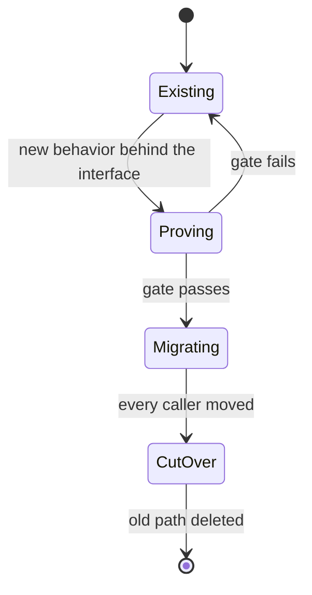

# Write a Plantifile

Make one source that a person can understand and an agent can act on.

This skill is downloaded into other repositories, so it contains every rule it needs.

## 1. Pick the document type

Choose one:

- `plan` — decide and deliver a change;
- `lesson` — understand and practice a topic;
- `guided-plan` — learn enough to judge and deliver a change.

Every document needs `title`, `kind`, and `emoji`.

`lesson` and `guided-plan` also need:

- one-line `audience` stating what the reader already knows;
- one to five `outcomes` that say what the reader can explain, predict, compare, trace, review, or do.

**Done when:** one document type clearly matches the reader’s job.

## 2. Gather evidence

For a plan or guided plan, read:

- the request, issue, or specification;
- repository instructions;
- the code that owns the behavior;
- every production caller;
- success, failure, and regression tests;
- public types, configuration, migrations, commands, and user docs that may change.

For a lesson, also find trustworthy sources for facts the repository cannot prove.

Run a small experiment only when source and tests cannot answer a runtime question. Record the command and result.

Put proven claims under `### Verified facts`. Cite repository paths plus symbols or line ranges. Cite test names for behavior.

Put assumptions under `### Inferences`. Start each with **Inference:** and say how it will be tested.

**Done when:** every important claim has evidence or is labeled as an inference.

## 3. Build the plan and learning path

### For `plan`

Name:

- the interface that owns the change;
- every caller that moves;
- every old path that is deleted;
- important input, output, ordering, failure, persistence, authorization, and performance rules;
- real decisions, tradeoffs, risks, delivery gates, and rollback.

### For `lesson`

Teach the smallest mental model needed for the outcomes:

1. show why it matters;
2. explain it with a real diagram, code example, table, or trace;
3. ask the reader to remember or predict;
4. reveal Answer and Why;
5. ask the reader to apply or explain the idea;
6. end with a recap and next action.

### For `guided-plan`

Do both. Put teaching beside the decision, risk, diagram, or phase that needs it. Do not add a separate textbook appendix.

**Done when:** the reader can say what changes, why it works, how to prove it, and what they should now understand.

## 4. Write reversible phases

Each `<Phase>` needs:

- tasks;
- an observable **Gate**;
- a concrete **Rollback**.

Good gates name a test, command, measured rule, count, or visible result. “Code complete” is not a gate.

Prove the new path first, move callers next, and delete old code last.

Use two useful diagrams with different jobs. Show request order, ownership, state, failure, or cutover. Do not add decorative diagrams.

**Done when:** every phase can be proved or rolled back without guessing.

## 5. Add real questions

Use `<Check>` for quizzes:

- `predict` — answer before seeing what happens;
- `recall` — remember a fact or relationship;
- `apply` — use the idea on a new case;
- `reflect` — explain a decision or uncertainty in your own words.

Every `lesson` and `guided-plan` needs:

- at least one `predict` or `recall` Check;
- at least one `apply` or `reflect` Check.

Each Check needs:

- a unique `id`;
- a `kind`;
- a plain-text `prompt` of 40 words or fewer;
- `**Answer:**`;
- `**Why:**`;
- optional `**Next:**`;
- optional `for="BLOCK_ID"` pointing to another root component in the same document.

Ask something that requires thought. Copying the previous sentence is not a quiz.

**Done when:** questions test both memory and transfer, and every answer explains why.

## 6. Lint, publish, and pull it back

Copy the template below and replace every uppercase placeholder.

Run:

```sh
plantifiles lint <file>
```

Fix every error and warning. Read the output because a zero exit code can still include warnings.

Publish:

```sh
plantifiles push <file> --workspace <slug> --emoji <emoji> --agent <agent-name> --prompt "<original request>"
```

Find the workspace when needed:

```sh
plantifiles workspaces
```

Pull the result once:

```sh
plantifiles pull <url> -o /tmp/published-plantifile.mdx
```

**Done when:** lint reports `errors 0 warnings 0`, push returns a URL, the page opens, and pulled Markdown contains the full document.

## Document rules

- Put exactly one `<TLDR>` first after frontmatter. Keep it at 60 words or fewer.
- Start every `##` section with one physical line of summary text, 30 words or fewer.
- Keep every paragraph at 120 words or fewer and five sentences or fewer.
- Use headings no deeper than `###`.
- Keep reading time at 12 minutes or less. Plantifiles counts 200 words per minute.
- Keep all prompts, answers, evidence, diagrams, code, gates, and rollback in source.
- Use Markdown, not raw HTML or executable MDX.
- Put component content on lines between opening and closing tags.
- Use only the components below. Unknown components, props, and values are errors.

For `plan` and `guided-plan`:

- include Decision, Phase, and Diagram;
- include one Rejected alternative;
- use two useful diagrams with different diagram types;
- give every Decision an owner;
- give every Phase tasks, Gate, and Rollback;
- give every Tradeoff at least two Options and exactly one recommendation;
- give every Risk low, med, or high severity.

For `lesson` and `guided-plan`:

- include audience and outcomes;
- include one retrieval Check and one transfer Check;
- warn on paragraphs above 60 words;
- end with outcomes revisited, unresolved uncertainty, and next action.

Plantifiles starts at 100 points, subtracts 10 per error and 3 per warning, and never goes below 0. Publication requires zero errors and score 70 or higher. This skill requires zero errors and zero warnings.

## Placement and IDs

Put `TLDR`, `Decision`, `Tradeoff`, `Rejected`, `Phase`, `Risk`, `Diagram`, `CodeSketch`, `Callout`, and `Check` at the document root.

`Option` is the only nested component. It must be a direct child of `Tradeoff`.

Every top-level component may have an `id`; Check requires one. IDs must:

- be unique;
- start with an ASCII letter;
- contain only ASCII letters, digits, `_`, or `-`;
- stay unchanged when a block moves or changes.

## Component reference

| Component | Required props | Put inside |
|---|---|---|
| `<TLDR>` | — | Result summary, at most 60 words |
| `<Decision>` | `owner` | One real unanswered question |
| `<Tradeoff>` | — | At least two direct Options |
| `<Option>` | `name`; exactly one sibling has `recommended` | Pros and cons |
| `<Rejected>` | `what` | Why the option lost |
| `<Phase>` | `n`, `title` | Tasks, Gate, and Rollback |
| `<Risk>` | `severity="low|med|high"` | Risk and mitigation |
| `<Diagram>` | `lang="mermaid|d2"` | One matching fenced diagram |
| `<CodeSketch>` | `lang`; optional `file` | One fenced code block |
| `<Callout>` | `kind="note|warning"` | Supporting context |
| `<Check>` | `id`, `kind`, `prompt`; optional `for` | Answer, Why, and optional Next |

For diagrams:

- use `sequenceDiagram` for requests, actors, ordering, and failure;
- use `stateDiagram-v2` for lifecycle and cutover;
- use `flowchart` or `graph` for data and control flow;
- use `erDiagram` for stored relationships.

Use `<CodeSketch>` only when a small type, payload, row, or function signature makes a rule clearer.

## Guided-plan template

For `plan`, remove audience, outcomes, and Checks when they add no value. For `lesson`, remove Decision, Phase, and other planning blocks that do not teach an outcome.

`````mdx
---
title: DOCUMENT TITLE
kind: guided-plan
emoji: 🧭
audience: READERS AND WHAT THEY ALREADY KNOW
outcomes:
  - Explain FIRST OBSERVABLE OUTCOME
  - Apply SECOND OBSERVABLE OUTCOME
---
<TLDR id="summary">
State what changes, what the reader will learn, and how success will be proved.
</TLDR>

## Evidence

Show what is true today and what still needs testing.

### Verified facts

- `PATH:SYMBOL` — FACT PROVED BY CODE.
- `CALLER_PATH:SYMBOL` — HOW THIS CALLER USES THE INTERFACE.
- `TEST_PATH:TEST NAME` — BEHAVIOR THIS TEST PROTECTS.

### Inferences

- **Inference:** ASSUMPTION. Prove it with TEST, COMMAND, OR OWNER DECISION before PHASE GATE.

<Check id="predict-current-failure" kind="predict" prompt="What breaks if only one side of the interface changes?">
**Answer:** EXPECTED FAILURE.

**Why:** MECHANISM THAT CAUSES THE FAILURE.

**Next:** WHAT TO INSPECT OR TRY.
</Check>

<Diagram id="current-flow" lang="mermaid">
```mermaid
sequenceDiagram
  Actor->>CurrentModule: current request
  CurrentModule->>Dependency: current operation
  Dependency-->>CurrentModule: result or failure
  CurrentModule-->>Actor: visible response
```
</Diagram>

## Design

Put the behavior behind one interface and state the rules callers can trust.

<Decision id="open-decision" owner="@OWNER">
What real question must OWNER answer before cutover?
</Decision>

<Tradeoff id="design-options">
<Option name="PREFERRED OPTION" recommended>
Why this option wins and what it costs.
</Option>
<Option name="OTHER VIABLE OPTION">
Why this option could work and what it costs.
</Option>
</Tradeoff>

<Rejected id="rejected-option" what="REJECTED OPTION">
Why this option lost.
</Rejected>

<CodeSketch id="target-interface" lang="ts" file="TARGET_PATH">
```ts
export type Input = { id: string };
export type Result = { id: string; status: "accepted" | "rejected" };

export declare function execute(input: Input): Promise<Result>;
```
</CodeSketch>

<Check id="recall-interface-rule" kind="recall" for="target-interface" prompt="Which rule must every caller be able to trust?">
**Answer:** THE IMPORTANT INTERFACE RULE.

**Why:** WHY BREAKING IT HURTS CALLERS.
</Check>

## Delivery

Prove the new path, move every caller, then delete the old path.

<Diagram id="cutover-lifecycle" lang="mermaid">

</Diagram>

<Phase id="phase-prove" n="1" title="Prove the interface">
- [ ] Add the new behavior behind INTERFACE
- [ ] Exercise success and failure with NAMED TESTS

**Gate:** COMMAND OR TEST produces EXPECTED RESULT.

**Rollback:** Restore LAST WORKING INTERNAL BUILD.
</Phase>

<Phase id="phase-migrate" n="2" title="Move every caller">
- [ ] Move NAMED PRODUCTION CALLERS
- [ ] Observe METRIC, COMPARISON, OR COUNT

**Gate:** OBSERVATION proves every caller uses the new path.

**Rollback:** Restore old routing before accepting new work.
</Phase>

<Phase id="phase-cleanup" n="3" title="Delete the old path">
- [ ] Delete old code, adapters, flags, configuration, and dead tests
- [ ] Update public types and user docs

**Gate:** Repository references find no caller of the old interface, and NAMED TESTS pass.

**Rollback:** Revert cleanup only while cutover evidence remains valid.
</Phase>

<Check id="apply-new-case" kind="apply" for="phase-prove" prompt="How would you prove the same interface under a different failure?">
**Answer:** EXPECTED TEST OR OBSERVATION.

**Why:** WHY THAT RESULT PROVES THE RULE.

**Next:** NEXT REAL ACTION.
</Check>

<Risk id="main-risk" severity="high">
Name the most likely serious failure and its concrete mitigation.
</Risk>

<Callout id="rollback-rule" kind="warning">
Keep rollback until cutover passes. Delete it with the old path instead of keeping two permanent interfaces.
</Callout>

## Recap

Restate what the reader can now explain and do.

- **Outcomes revisited:** FIRST OUTCOME and SECOND OUTCOME.
- **Unresolved uncertainty:** OPEN DECISION OR REMAINING GAP.
- **Next real action:** FIRST DELIVERY STEP.
`````
